# 文因经

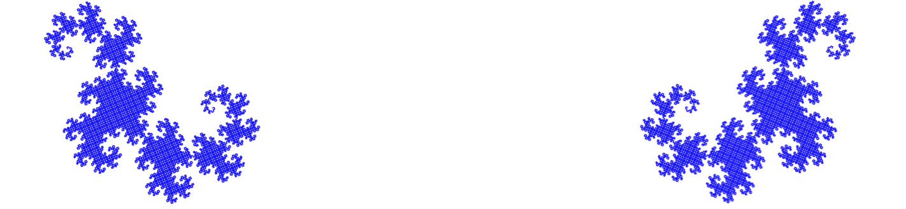

## 昰之昰

{:start="0"}
0. 普遍怀疑，否定一切。

> 诗0.1 我们的故事从真空开始，意识的真空

> 诗0.2 闭着的眼。
>
> 

{:start="1"}
1. 接受森罗万象。

> 诗1.1
>
> 

> 诗1.2 阳春召我以烟景——李白

## 昰之玄

0. 认识论。我们依赖着这些先天的、后天的认知方法，有了这些认知方法，才有了其后的所有内容。

1. 统计关联。赋予原子现象以结构。📜[简介](https://www.dropbox.com/s/0sh3xkv74bmyzc1/%E7%AE%80%E4%BB%8B.pdf?dl=0)， [Population coding of shape in area V4](https://www.dropbox.com/s/ynu5eou6lycarpj/PasCon02.pdf?dl=0)，[Functional neuroanatomy of intuitive physical inference](https://www.dropbox.com/s/k20ptxmum07892t/PNAS-2016-Fischer-E5072-81.pdf?dl=0)，[Premotor cortex and the recognition of motor actions](https://www.dropbox.com/s/zpoa7j0xbdzskxh/S_C3_A3_Rizzolatti_1996.pdf?dl=0)，[Decoding Sound and Imagery Content in Early Visual Cortex](https://www.dropbox.com/s/66agzdw87t1at1l/1-s2.0-S0960982214004588-main.pdf?dl=0)，[Ventral Intraparietal Area of the Macaque: Congruent Visual and Somatic Response Properties](https://www.dropbox.com/s/mb46qfvblfqqqir/126.full.pdf?dl=0)，[Decoupled Neural Interfaces using Synthetic Gradients](https://www.dropbox.com/s/7jrwt2cnwol71vi/1608.05343.pdf?dl=0)，[Diverse Suppressive Influences in Area MT and Selectivity to Complex Motion Features](https://www.dropbox.com/s/enn993s8zs2h1p3/16715.full.pdf?dl=0)，[Structure and Function of Visual Area MT](https://www.dropbox.com/s/qdnl8dvinqv36w3/born-bradley-mt-arn2005.pdf?dl=0)，[Decoding complex flow-field patterns in visual working memory](https://www.dropbox.com/s/p0vjlxor27h0dny/christophel2014.pdf?dl=0)，[Visual working memory enhances neural representations of matching visual input](https://www.dropbox.com/s/6gqxjfx8mv2kuiu/f1000research-125527.pdf?dl=0)，[Cortical responses to invisible objects in the human dorsal and ventral pathways](https://www.dropbox.com/s/rsivsbqejc62x8q/Fang-He-nn1537.pdf?dl=0)，[Experience-dependent spatial expectations in mouse visual cortex](https://www.dropbox.com/s/qs520emvxd8tqdx/fiser2016.pdf?dl=0)，[A functional and perceptual signature of the second visual area in primates](https://www.dropbox.com/s/2sl6mbolkt24slt/freeman_etal_2013.pdf?dl=0)，[Decoding reveals the contents of visual working memory in early visual areas](https://www.dropbox.com/s/adbmma3wk80ypon/Harrison%20Nature%202009.pdf?dl=0)，[RECEPTIVE FIELDS AND FUNCTIONAL ARCHITECTURE OF MONKEY STRIATE CORTEX](https://www.dropbox.com/s/g62tormb9s7ka4j/jphysiol01104-0228.pdf?dl=0)，[The Fusiform Face Area](https://www.dropbox.com/s/6bzwtfnoaf8948x/KanwisherMcDermottChunJNeuro97.pdf?dl=0)，[Less Is More](https://www.dropbox.com/s/vboc5f6y5frgey8/KokJeheeDeLange_Neuron2012.pdf?dl=0)，[Goal-dependent dissociation of visual and prefrontal cortices during working memory](https://www.dropbox.com/s/d7xp3ef8tzwi0x1/lee2013.pdf?dl=0)，[Crowding, grouping, and object recognition](https://www.dropbox.com/s/hx90gqve9qs4loj/Manassi_JOV_2015.pdf?dl=0)，[Selectivity for the Shape, Size, and Orientation of Objects for Grasping in Neurons of Monkey Parietal Area AIP](https://www.dropbox.com/s/hfwm39qtel5tj72/Murata-Gallese%202000.pdf?dl=0)，[Dynamics of motion signaling by neurons in macaque area MT](https://www.dropbox.com/s/uozryjtfi7px7jy/Smith.Majaj.Movshon.NatNeurosc.2005.pdf?dl=0)，[Nonstimulated early visual areas carry information about surrounding context](https://www.dropbox.com/s/98iia1ngweuutrj/PNAS-2010-Smith-20099-103.pdf?dl=0)。

> 诗1.1 眼见耳闻的现象显然不是随机的，有一种美在召唤着我们去注视。

> 诗1.2
>
> 
>
> 一帧完整的现象
>
> 

> 诗1.3
>
> 
>
> 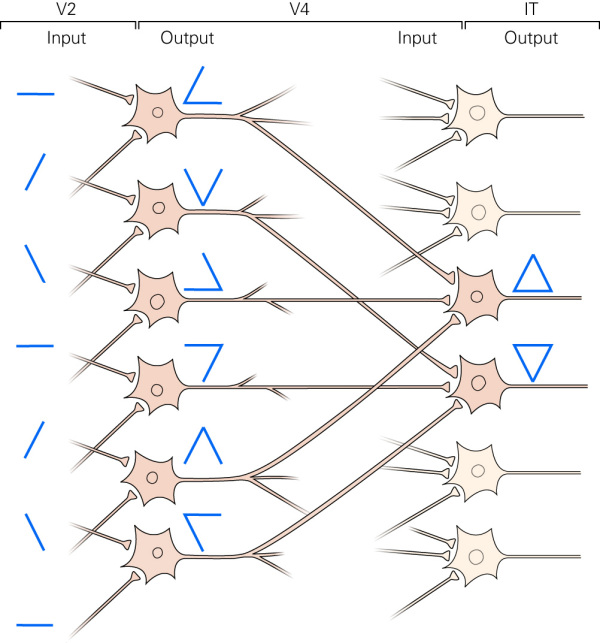
>
> V2皮层把边缘（edges，contour）表示成简单形状，然后由V4皮层中神经网络的处理，特征被逐层处理，复杂物体最终在IT皮层被表示出来。

> 诗1.4
>
> 格式塔心理学把构造主义的元素说讥称为“砖块和灰泥心理学”，说它用联想过程的灰泥把元素的砖块粘合起来，借以垒成构造主义的大厦。
>
> 问题在于：一个人往窗外观望，他看到的是树木、天空、建筑，还是组成这些物体的各种感觉素质，例如亮度、色调等等。如果是前者，则构造主义的大厦就会倒塌。

{:start="2"}
2. 特征提取。将现象进行统计，提取出对象的特征，这是构成对象的属性，对象是一个N元组。

> 诗2.1
>
> "The theme of this book is that a universe comes into being when a space is severed or taken apart. The act is itself already remembered, even if unconsciously, as our first attempt to distinguish different things in a world where, in the first place, the boundaries can be drawn anywhere we please. At this stage the universe cannot be distinguished from how we act upon it, and the world may seem like shifting sand beneath our feet.”

{:start="3"}
3. 私人指称。也叫索引，用一个信号指称一个事物或现象。

> 诗3.1
>
> 人不能两次踏进同一条河流。
>
> ——赫拉克利特

> 诗3.2
>
> 
>
> 事物是一颗星，中间是指称（索引），四周的光芒是事物的特征或属性。
>
> 原子现象如尘埃，是铸成它们的血肉，光芒从黑暗中散发出来，遮掩了它们永远神秘的核心。

{:start="4"}
4. 世界。将所有的现象称为世界。
5. 懒惰原理。感受到现象世界的相对无穷无尽和自身认知和精力的相对有限。
6. 抽象。由一个信号指称多个事物或现象。

> 诗6.1
>
> 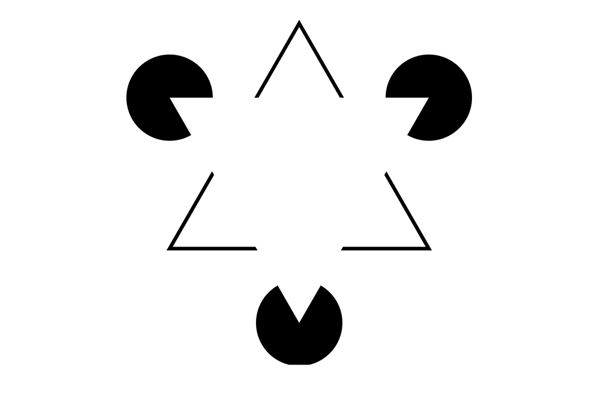
>
> Kanizsa三角形；
>
> 
>
> 从900个像素点到6个分立的黑色图形；
>
> 
>
> 从6个分立的黑色图形到5个封闭图形；
>
> 
>
> 从5个具体的封闭图形到2个抽象几何图形，并命名为「圆形」、「三角形」，其属性有颜色、大小、方向、边框4种属性。
>
> 随着认知的加工，对象越来越少。

{:start="7"}
7. 具体。由一个抽象指称，加上特殊限定，指称更小范围的事物或现象。
8. 现象用对象间的相互作用描述。
9. 用词项指称对象。用谓词指称相互作用，用命题指称现象。
10. 归纳法。用归纳法组织统计关联，这是一个增加信息的过程。

> 诗10.1
>
> 如果依据过去的经验太阳总是从东边升起而从西方落下，那么归纳推理就会告诉我们太阳在未来可能还是会从东边升起而从西方落下。但我们又要怎么解释我们有能力做出这样的推论呢？
>
> ——大卫·休谟

> 诗10.2
>
> 我所提倡的哲学可以命名为逻辑原子主义或绝对多元论,因为它确定有许多单独事件,并否定某种由那些事件所组成的统一。把世界看成由许许多多相互独立的事件或事实构成的,这是从本体论意义而言的,从本体论角度看,这种观点是绝对多元论。
>
> ——罗素《神秘主义与逻辑》

{:start="11"}
11. 宾我。延引他人（发现他人身体与自己身体的相似性，发现他人的死亡伴随着他人活动的消失，猜测意识与身体的联系），自己的身体，镜中自己的形象，那个可以控制眼睛睁开、关闭的意识，发现它们紧密关联在一起，于是统合为一个对象，称为「宾我」，这是一个停留在现象内的自我。📜 [宾我](https://www.dropbox.com/s/nloheh2wyqnn4o1/%E5%AE%BE%E6%88%91.pdf?dl=0)。

> 诗11.1 威廉·詹姆斯的经验自我（Me）。

> 诗11.2
>
> 我思故我在？
>
> 思未必有主语。

{:start="12"}
12. 因果关系。
13. 演绎法。📜 [Precursors  of  logical  reasoningin  preverbal  human  infants](https://www.dropbox.com/s/dlzbya596sn8xmc/10.1126%40science.aao3539.pdf?dl=0)。

> 诗13.1
>
> 通过研究婴儿的行为和眼动，表明了12个月和19个月的婴儿能够进行简单的选言三段论（Disjunctive Syllogism），说明人类的逻辑能力存在独立的起源，并不依赖于语言的习得。一些基本的逻辑能力可能是与生俱来的。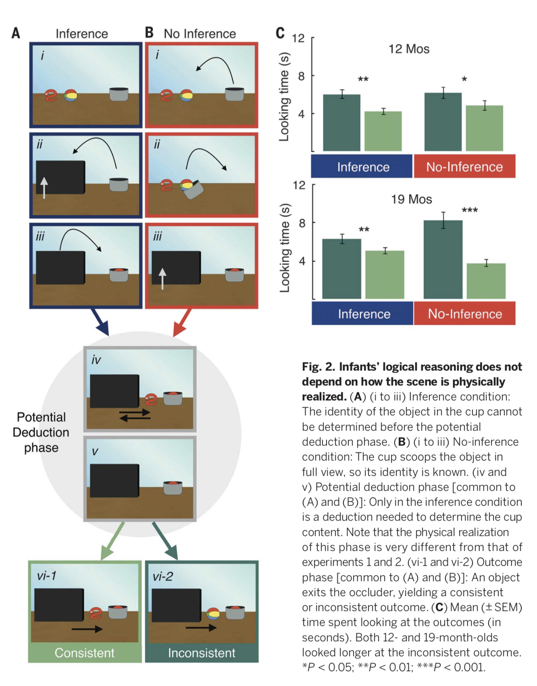

> 诗13.2
>
> 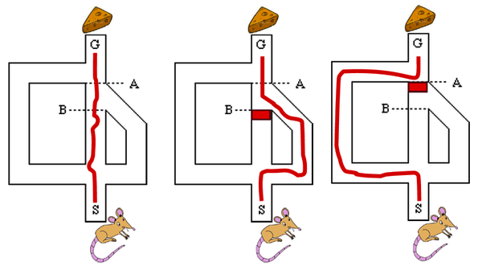
>
> Tolman「老鼠走迷宫」实验

{:start="14"}
14. 加入等效原理。在数学和自然科学理论中，那些已被证明的命题对于该理论的任意模型都可使命题为真。
15. 加入事实模型的可验证性条件。
16. 齐一性原理，世界总是以同样方式起作用。
17. 简单原理，世界最终是简单的。由懒惰原理得，同奥卡姆剃刀原理等效。

> 诗17.1
>
> 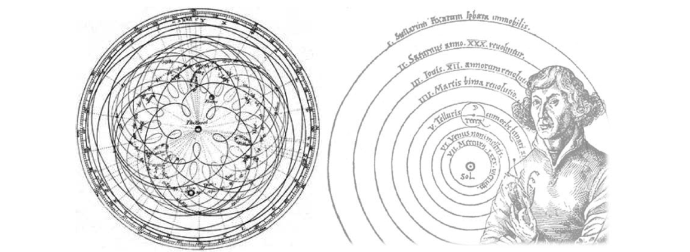
>
> 化繁杂的地心说为简明的日心说。

{:start="18"}
18. 统一性原理。世界有可能用一种统一的理论理解。
19. 公共指称。我们首先从现象中用分类、聚类的办法抽取出对象-相互关系。在一个语境下，对象-相互关系是比较特定的，比如猴子所在的稀树草原，狮子、鹰、蛇等。这些对象-相互关系构成一个网络，边是相互关系，节点是对象，整个语境的特征就是网络的拓扑性质。
然后我们用名词、动词去模拟上面这个网络的结构，鹰吃蛇、蛇吃猴这样一个语义网络，如果不限制语境，这个网络的语义是任意的。但是限制语境后，不同的人都通过相似性去找语义，两个网络能点和点一一对应、边和边一一对应地重合，便获得意义，语言也完成指称。特定语境下，两个网络能否重合是比较偶然的，所以不同的人对指称的歧义不大。公共的指称主要在结构中完成的，而不是节点中独自完成的。

> 诗19.1
>
> 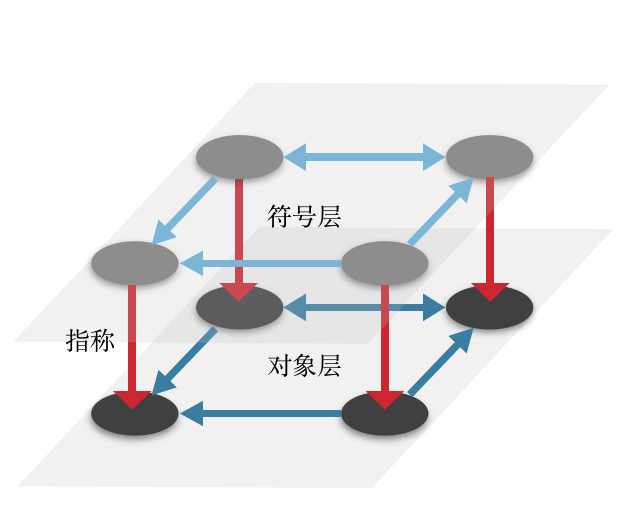
>
> 这就是个大型隐喻了。

{:start="20"}
20. 可信度杠杆。自我的感知有限，无法跨越特定的时间、空间，若他人、仪器与自己的观测方法一致，且可经取样抽查检验，则可以信任他人或仪器得出的观测、知识。

> 诗20.1
>
> 井蛙不可以语于海者，拘于虚也；夏虫不可以语于冰者，笃于时也。
>
> ——《庄子·秋水》

> 诗20.2 这也可以理解为一种杠杆思维。

## 昰之要

{:start="0"}
0. 世界观。📜 [费曼物理学讲义卷1](https://www.dropbox.com/s/5eai9gu1qsjzkdg/%E8%B4%B9%E6%81%A9%E6%9B%BC%E7%89%A9%E7%90%86%E5%AD%A6%E8%AE%B2%E4%B9%89%5B%E6%96%B0%E7%89%88%E7%AC%AC%E4%B8%80%E5%8D%B7%5D.pdf?dl=0)，[卷2](https://www.dropbox.com/s/ewlxbgd863n48zc/%E8%B4%B9%E6%81%A9%E6%9B%BC%E7%89%A9%E7%90%86%E5%AD%A6%E8%AE%B2%E4%B9%89%5B%E6%96%B0%E7%89%88%E7%AC%AC%E4%BA%8C%E5%8D%B7%5D.pdf?dl=0)，[卷3](https://www.dropbox.com/s/adfz7ixuso54q90/%E8%B4%B9%E6%81%A9%E6%9B%BC%E7%89%A9%E7%90%86%E5%AD%A6%E8%AE%B2%E4%B9%89%5B%E6%96%B0%E7%89%88%E7%AC%AC%E4%B8%89%E5%8D%B7%5D.pdf?dl=0)，[Mathematical methods for Physics and engineering](https://www.dropbox.com/s/p4dobzhx2kucn3k/Mathematical%2Bmethods%2Bfor%2Bphysics%2Band%2Bengineering%2BRiley.pdf?dl=0)，[All the Mathematics you missed but need to know](https://www.dropbox.com/s/hb8zhesr3ououao/%E6%95%B0%E5%AD%A6%E6%8B%BE%E9%81%97%2Ball%2Bthe%2Bmathematics%2Byou%2Bmissed%2Bbut%2Bneed%2Bto%2BknowGarrity.pdf?dl=0)，[Classical Mechanics- Systems of Particles and Hamiltonian Dynamics](https://www.dropbox.com/s/ytns3bjv1vt0v8i/Classical_Mechanics-Systems_of_Particles_and_Hamiltonian_Dynamics___Greiner_-libre.pdf?dl=0)，[Introduction to Electrodynamics](https://www.dropbox.com/s/io5mvzkfplb46ku/Introduction%2Bto%2BElectrodynamics%2B3rd%2BGriffiths.pdf?dl=0)，[Classical Electrodynamics](https://www.dropbox.com/s/sobjxep252m7g03/Classical%2BElectrodynamics%2B3rd%2Bed%2BJackson.pdf?dl=0)，[An Introduction to Thermal physics](https://www.dropbox.com/s/ykuiff6asih9d42/An%2BIntroduction%2Bto%2BThermal%2Bphysics%2BSchroeder.pdf?dl=0)，[Introduction to Quantum Mechanics](https://www.dropbox.com/s/kq0rujr78xf1r6z/Introduction%2Bto%2Bquantum%2Bmechanics%2BGriffiths.pdf?dl=0)，[Topics in Statistical Mechanics](https://www.dropbox.com/s/ye77ftb70uken7z/Topics%2Bin%2Bstatistical%2Bmechanics%2BCowan.pdf?dl=0)，[固体物理导论](https://www.dropbox.com/s/axqz5j44lnq8ky4/%E5%9B%BA%E4%BD%93%E7%89%A9%E7%90%86%E5%AF%BC%E8%AE%BA%2BKittel.pdf?dl=0)，[Introduction to Elementary Particles](https://www.dropbox.com/s/w133vero8nwc5cb/Introduction%2Bto%2BElementary%2BParticles%2BGriffiths.pdf?dl=0)，[Nuclear models](https://www.dropbox.com/s/bowcc1bnxrb5xl4/Nuclear%2BModels%2BGreiner.pdf?dl=0)，[Statistical Mechanics, Algorithms and Computations](https://www.dropbox.com/s/jx9fkbr3zsfgzui/Statistical%2BMechanics%2BAlgorithms%2Band%2BComputations%2BKrauth.pdf?dl=0)，[Advanced Topics in Applied Mathematics](https://www.dropbox.com/s/pp1qvowzewyyvxu/Advanced%2BTopics%2Bin%2BApplied%2BMathematics%2BSudhakar%2BNair.pdf?dl=0)，[Field Quantization](https://www.dropbox.com/s/e598wl40ynolkuk/Field%2BQuantization%2BGreiner.pdf?dl=0)，[General Relativity](https://www.dropbox.com/s/0oswf5kuxi46q0i/General_RelativityWald.pdf?dl=0)，[微分几何入门与广义相对论](https://www.dropbox.com/s/bekmp94yoe4b32h/%E5%BE%AE%E5%88%86%E5%87%A0%E4%BD%95%E5%85%A5%E9%97%A8%E4%B8%8E%E5%B9%BF%E4%B9%89%E7%9B%B8%E5%AF%B9%E8%AE%BA-2nd%EF%BC%88%E4%B8%8A%E4%B8%AD%E4%B8%8B%E5%85%A8%E5%86%8C%EF%BC%89%2B%E6%A2%81%E7%81%BF%E5%BD%AC.pdf?dl=0)，[Introduction to Cosmology](https://www.dropbox.com/s/vbe43hoi019p3ti/Introduction%2Bto%2Bcosmology%2B3rd%2BJohn%2BWiley.pdf?dl=0)，[Quantum Chromodynamics](https://www.dropbox.com/s/4unvj3isjsuf23d/Quantum%2BChromodynamics%2B3rd%2BGreiner.pdf?dl=0)，[A First course in String Theory](https://www.dropbox.com/s/mr90pvf8nu03le3/A%2BFirst%2BCourse%2Bin%2BString%2BTheory%2B2nd%2B%2BZwiebach.pdf?dl=0)，[Quantum mechanics Symmetries](https://www.dropbox.com/s/o728wo6wy3ns8f4/Quantum%2Bmechanics.%2BSymmetries%2B2nd%2BGreiner.pdf?dl=0)，[the field theory vol.1](https://www.dropbox.com/s/hqzp7ty8emalae3/Weinberg%2BS.%2BThe%2BQuantum%2BTheory%2Bof%2BFields%2BVol%2B1%2BFoundations.pdf?dl=0)，[vol.2](https://www.dropbox.com/s/d3sr9zwp5um2lhe/Weinberg%2BS.%2BThe%2BQuantum%2BTheory%2Bof%2BFields%2Bvol.%2B2.%2BModern%2BApplications%2BCUP%2B1996.pdf?dl=0)，[vol3](https://www.dropbox.com/s/pxkoos7or9hp6ps/Weinberg%2BS.%2BQuantum%2Bfield%2Btheory%2Bvol.3%2BSupersymmetry.pdf?dl=0)。
1. 状态波函数和概率。对于一个微观体系，它的状态和有关情况可用波函数 Ψ(x,y,z,t) 表示。Ψ 称为体系的状态函数（简称态），它包括体系所有的信息。Ψ 是单值的，即在空间每一点Ψ 只能有一个值。Ψ 是连续的，即 Ψ 的值不能出现突跃；Ψ(x,y,z,t) 对 x,y,z 的一级微商也应是连续的。Ψ 平方可积的（有限），即 Ψ 在整个空间的积分 ∫ Ψ·Ψ dτ 应为一有限值，通常要求波函数归一化，即 ∫ Ψ·Ψ dτ ＝ 1。
2. 力学量和线形厄米算符。对一个微观体系的每个可观测的力学量，都对应着一个线性厄米算符，ÂΨ = aΨ。
3. 征方程与薛定谔方程。若某一力学量 A 对应的算符 Â 作用于某一状态函数ψ后，等于某一常数 a 乘以 ψ，即 Âψ = aψ，那么对 ψ 所描述的这个微观体系的状态，其力学量 A 具有确定的数值 a，a 称为力学量算符 Â 的本征值，ψ 称为Â的本征态或本征函数，Âψ = aψ 称为 Â 的本征方程。
4. 叠加原理。若 ψ1，ψ2… ψn 为某一微观体系的可能状态，由它们线性组合所得的ψ = c1ψ1 + c2ψ2 + … + cnψn 也是该体系可能的状态。
5. Pauli 原理。描述多电子体系空间运动和自旋运动的全波函数，交换任两个电子的全部坐标（空间坐标和自旋坐标），必然得到反对称的波函数。
6. 爱因斯坦相对性原理。物理规律在所有惯性系中都具有相同的形式。
7. 光速不变原理。在所有的惯性系中，光在真空中的传播速度中具有相同的值 C。
8. 时空均匀且各向同性。
9. 所有的进化现象都可以用一个将遗传机制和观察到的现象统一起来的方式来解释。
10. 进化是渐进的：微小的变化在自然选择的作用下，经过长时间的积累；物种（性状）的不连续性可以用进化过程中的地理隔离和物种灭绝事件来解释。
11. 自然选择是目前为止主要导致变异的因素；微小的有利变异经过长时间积累也会导致显著的性状变化；自然选择影响物种在其生境中的表型。
12. 遗传漂变的作用不可忽视。
13. 群体是进化的基本单位，而不是个体。自然群体的遗传多样性是进化的重要因子。在自然群体中，自然选择的作用比之前认为的更大。生态因子，比如生态位，以及基因流的作用很重要。

> 诗13.1
>
> “小群体大潜能：为了更好地理解这些因素是如何相互作用，从而改变进化的，首先我们要知道，如果一个群体想要在遗传和文化上吸收任何新东西，那么这个群体需要非常小。数量大、密度高的群体，“遗传惯性”比较大，很难使整个群体朝着特定方向发展。相反，小而独立的群体则常常可以产生提携不同的特性。……产生小而独立的群体，不仅为基因和文化的创新提供了理想环境，同时保证了物种的形成。当环境再次改善之后，经历过转变的古人类种群会再次扩张，并且和其他群体接触。如果产生新的种群，那么竞争和淘汰过程就会发生。如果新的种群并没有出现，或者出现的不那么彻底，任何新的基因都会被吸收到一个融合的种群中。”
>
> ——《现代人起源于偶然事件？》

{:start="14"}
14. 在古生物学中，从微观进化推演到宏观进化可以用来解释历史上观测到的一些现象。渐进主义并不等于进化的速率始终不变。
15. 基因。指携带有遗传信息的DNA序列，是控制性状的基本遗传单位，亦即一段具有功能性的DNA序列。基因通过指导蛋白质的合成来表现所携带的遗传信息，从而控制生物个体的性状（差异）表现。

> 诗15.1 「基因」来自希腊语，意思为“生”。

{:start="16"}
16. 生物的行为由“复制更多自身基因”的动机支配。社会行为、利他行为可以由此解释，也可由内含适应性和亲选择解释。（在许多情形下，基于内含适应性的计算，和基于个体适应性的计算，会得出近似的结果（因此我们常常可以用“自私的个体”去近似“自私的基因”））。📜 [Sociobiology](https://www.dropbox.com/s/s3z3brh0xyfyoe6/Edward%20O.%20Wilson-Sociobiology_%20The%20Abridged%20Edition%20%20-Belknap%20Press%20of%20Harvard%20University%20Press%20%281980%29.pdf?dl=0)。

17. 性的代价。相比孤雌生殖，个体需要接受性选择，也就需要额外发育出很多第二性征。相比孤雌生殖，亲本只能把自己50%的基因传给下一代。相比孤雌生殖，有性生殖给寄生基因创造机会（比如杀死没有携带它们的精子）。

18. 性的益处。因为「自私的基因」所以性必须对群体和个体都有益处。📜 [生命的跃升](https://www.dropbox.com/s/gydyuec0oj08cgu/%E7%94%9F%E5%91%BD%E7%9A%84%E8%B7%83%E5%8D%87%E2%80%94%E2%80%9440%E4%BA%BF%E5%B9%B4%E6%BC%94%E5%8C%96%E5%8F%B2%E4%B8%8A%E7%9A%84%E5%8D%81%E5%A4%A7%E5%8F%91%E6%98%8E.pdf?dl=0)。

    1）对个体的眼下益处。有性生殖可以帮助个体适应变化的环境。红色皇后假说：有性生殖可以让个体处于变化之中来应付寄生虫。

    2）对群体的长远益处。可以将独立的有益突变组合在一起而不是再各自造轮子。绝大部分突变都是有害的，有害突变要回复突变为正常基因很难，对于较小的无性繁殖种群（自然选择不一定能筛选出适应个体），种群会一代代退化，称为穆勒棘轮，有性生殖可以避免它，性可以把分散的未突变基因集合在一起，重新创造完美无瑕的个体。一个好基因不会因为同一条染色体上其他的坏基因而埋没（选择干扰），一个好基因的扩散也不会消灭同一条染色体上其他基因的多样性。

> 诗18.1
>
> 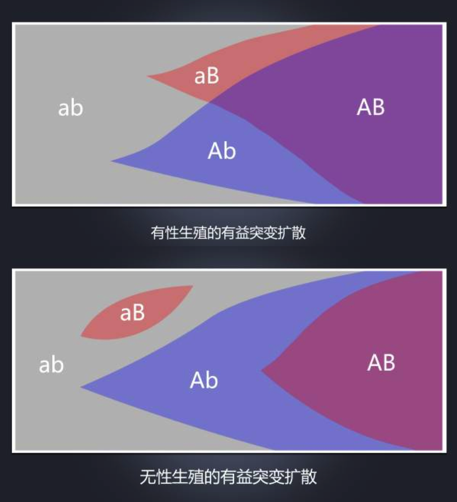
>
>
>
> 新的有益突变的扩散状况对比，上图是有性生殖，下图是无性生殖。在有性的情况下，有益突变把a变成了A，把b变成了B，二者很快就能靠重组结合在一起，得到最佳的AB组合。但如果没有性，A的扩张就意味着B的收缩，反之亦然。因此最佳的AB组合只能等待B突变在Ab群体内再次发生。

> 诗18.2
>
> 突变就像是罪孽，如果突变率达到了每代一个的速度——每个人都是罪人——那么在一个无性生殖种群里，除去罪孽的唯一方式就是消灭整个种群：来一场大洪水全淹死，用火和硫磺把她们炸飞，或者感染一场瘟疫什么的。但是，如果有性生殖的个体能够承担一定数量（但不要太多）的突变而不遭伤害，那么性就有能力把两个健康双亲身上携带的很多有害突变聚集起来，集中到一个孩子身上。这是新约的方法。正如耶稣基督为全人类的罪孽而死一样，性也可以把整个种群积累起来的突变集中到一只替罪羊身上，然后把它钉十字架。
>
> ——马克·里德利（Mark Ridlley）

> 诗18.3
>
> 
>
> 美洲龙纹螯虾发生基因突变之后，获得了孤雌生殖的能力，它们极速繁殖、疯狂扩张，短短二十年间席卷整个欧洲。罪恶的傲慢者，经受不住结晶的诱惑，把自身的秩序与混元隔绝开来，企图据为己有，享受永恒的安稳，等待他们的只有穆勒棘轮的残酷碾压。

{:start="19"}

19. 缓慢的内部调控：内分泌系统。对机体生理过程起调节作用。

    1） 第一类为类固醇，如肾上腺皮质激素（皮质醇、醛固酮等）、性激素（雌激素、孕激素及雄激素等）；
    2） 第二类为氨基酸衍生物，有甲状腺素、肾上腺髓质激素、松果体激素等；
    3）第三类激素的结构为肽与蛋白质，如下丘脑激素、垂体激素、胃肠激素、胰岛素、降钙素等；
    4）第四类为脂肪酸衍生物，如前列腺素。

    特点是：

    1）高度专一性包括组织专一性和效应专一性。前者指激素作用于特定的靶细胞、靶组织、靶器官。后者指激素有选择地调节某一代谢过程的特定环节；

    2）极高的效率激素与受体有很高的亲和力，因而激素可在极低浓度水平与受体结合，引起调节效应；

    3）信使性。激素只是充当“信使”启动靶细胞固有的、内在的一系列生物效应，而不作为某种反应成分直接参与细胞物质与能量代谢的环节；

    4）内分泌的调控是多层次的。下丘脑是内分泌系统的最高中枢，它通过分泌神经激素，即各种释放因子（RF）或释放抑制因子（RIF）来支配垂体的激素分泌，垂体又通过释放促激素控制甲状腺、肾上腺皮质、性腺、胰岛等的激素分泌。相关层次间是施控与受控的关系，但受控者也可以通过**反馈机制**反作用于施控者。

> 诗19.1
>
> 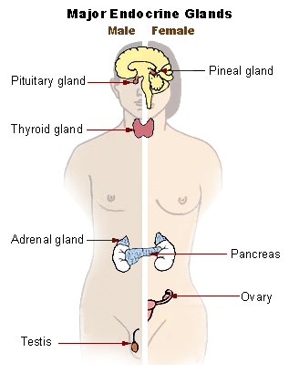

{:start="20"}

20. 快速的内部调控：植物神经系统。是一个控制系统，很大程度上是无意识地调节身体机能，如心率，消化，呼吸速率，瞳孔反应，排尿，性冲动。 该系统主要是控制“应激”及“应急”反应。由处于相互平衡制约中、功能相反的交感和副交感神经构成。
21. 外部行为调节：反射。初生儿就可完成一些最简单的非条件反射，如吸吮反射、吞咽反射、排尿反射、排便反射和屈肌反射等。以后由于机体不断接触外界环境，经过训练可逐渐形成越来越多的条件反射。
22. 外部行为调节：情绪系统。描述为针对内部或外部的重要事件所产生的突发反应，情绪会产生动机。

> 诗22.1
>
> 奖励系统（图中阿肯伯氏核为accumbens nucleus，即伏隔核）
>
> 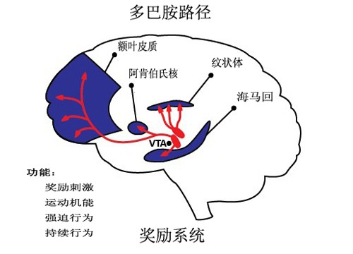
>
> 行为—>环境—>反馈（成功／失败）—>快乐／痛苦—>强化行为／抑制行为。

> 诗22.2
>
> 1954年， James Olds与Peter Milner在大白鼠的隔区植入电极，发现大白鼠选择按压一个刺激该电极的开关. 大白鼠持续选择此操作甚至停止了吃喝。这暗示此区域是大脑的欣快中心。然而隔核并不直接连通到伏隔核。 伏隔核（简写记号：NAcc）也被称为依伏神经核，是一组波纹体中的神经元。在大脑的奖赏、快乐、笑、成瘾、侵犯、恐惧及安慰剂效果等活动中起重要作用。
>
> 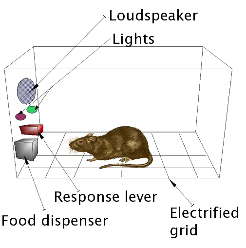

{:start="23"}

23. 最复杂的外部行为调节：叙事系统。根据叙事方式的不同调控情绪系统。

> 诗23.1
>
> 一个典型的例子是，奥运会上获得铜牌的选手比获得银牌的选手更高兴，前者庆幸自己获得奖牌，后者则遗憾没有拿到第一。

> 诗23.2
>
> 2002年诺贝尔经济学奖得主丹尼尔·卡尼曼就做过一项开创性的实验，请一组志愿受试者参加一项分成三阶段的实验。在“短”阶段的实验中，受试者将一只手放入14℃的水中一分钟，而这种水温会让人不悦甚至痛苦。60秒后，就请他们把手拿出来。而在“长”阶段的试验中，受试者的手会放入另一个容器中，水温同样是14℃。但在60秒后，会偷偷将热水导进容器，使水温略升为15℃。有些受试者会先做“短”实验，也有些从“长”实验开始。但不论哪种，都会在两部分都结束的7分钟后，开始第三（也是最重要的）阶段。研究人员告知受试者，他们必须重复前两阶段的其中之一，可以自由选择。足足有80%的人选择了“长”实验，在印象中以为这没那么痛苦。

> 诗23.3
>
> 前额叶皮层功能最典型的心理术语是执行功能。执行功能的能力涉及区分冲突思想、确定好与坏、更好与最佳、相同和不同、当前行为的未来后果、致力于确定目标、预测结果、基于行为的预期和社会“控制”（压抑冲动的能力，如果不被压制，会导致社会上不可接受的结果）。其中的**DLPFC**(dorsolateral prefrontal cortex 背外侧前额叶皮层)是人类和非人类灵长类大脑前额叶皮层区域。 它是人类大脑最近衍生的部分之一。 它经历了长时间的发育，持续到成年。 DLPFC不是解剖结构，而是功能性结构。它也是涉及动机规划，组织和管理的最高皮质区域。

{:start="24"}

24. 人的大部分行为受无意识驱动，小部分行为受意识驱动。

## 玄之昰

1. 在《昰》经中，我们已经有了描述的知识，这是我们所面对的现象。但三目魔王的三只魅惑魔目引诱我们进入更大的想象之地，它们是「昌生目」、「真昰目」、「誓信目」。

> 诗1.1 来吧，来啊，我在神秘之地等候你。

{:start="2"}
2. 汹生魅惑之壹。现象中没有人的价值，神秘之地却有。

> 诗2.1
>
> 人是那些不能预料结果的原因之产物，人的渊源、生长、希望、恐惧、爱，以及信念都只是原子的偶然安排，热情、英雄主义、情感和思想之强烈性，都不能使个人的生命延续于墓园之外，积年累月的辛劳，一切的虔诚，一切的灵感，一切人类天才之光辉都命定了要在太阳系的死亡中灭绝，人类的一切成就，都需被埋葬于宇宙的废墟之下。这一切，虽然不是全然无可争议，但是几乎是如此确定以至于任何否定这一切的哲学都不能希望站立得住。今后，灵魂的聚居只能安全的被建筑在这些真理的框架之内和不屈服的绝望的坚实的基石之上。
>
> ——罗素《一个自由人的崇拜》

> 诗2.2
>
> 我们要归向哪里？那是永恒的乌有，在乌有中无以寄托、无以附着、无以支撑，黑暗的乌有预示了世界的不可知，自己便是那不可知中悬浮的微粒，在悬浮中不定地漂移着，从一头被推到另一头……，这种状态对我们既是自然的，又是违反我们的意志的。我们心中燃烧着想要一块坚固的基地与一个持久的最后据点的愿望，以期在这上面建立起一座能上升到无穷的高塔，我们揣着万般情怀寻找着人类共有的精神家园，追寻着思想的永恒和不朽，但是，我们整个的基础破裂了，大地裂为深渊。
>
> ——帕斯卡尔

{:start="3"}
3. 汹生魅惑之贰。现象没有给人的自由留出位置，神秘之地却有。📜 [主我](https://www.dropbox.com/s/g6v8vkzca29gx2j/%E4%B8%BB%E6%88%91.pdf?dl=0)，[Learned helplessness : a theory for the age of personal control](https://www.dropbox.com/s/zabpfhdv6lpy6ev/Learned%20helplessness%20-%20a%20theory%20for%20the%20age%20of%20personal%20control.pdf?dl=0)，[Learned Helplessness in Humans: Critique and Reformulation](https://www.dropbox.com/s/bbelvl3dhxf9299/775276f83a46162a9b364335d9ee5ee73b99.pdf?dl=0)，[LEARNED HELPLESSNESS IN GROUPS](https://www.dropbox.com/s/ug7a1gwlh2s0hsr/005799765.pdf?dl=0)，[FAILURE TO ESCAPE TRAUMATIC SHOCK](https://www.dropbox.com/s/lpzcdkopjm6wcpx/seligman.pdf?dl=0)。

> 诗3.1
>
> Our puppet strings are hard to see,
>
> So we perceive ourselves as free,
>
> Convinced that no mere objects could
>
> Behave in terms of bad and good.
>
> To you, we mannikins seem less than live,
>
> because our consciousness is that of dummies,
>
> made to sit on laps of gods and mouth their wit;
>
> Are you, our transcendental gods,
>
> likewise dangled from your rods,
>
> and need, to show spontaneous charm,
>
> some higher god’s inserted arm?
>
> We seem to form a nested set
>
> with each the next one’s marionette,
>
> who, if you asked him, would insist
>
> that he’s the last ventriloquist.
>
> ——Ted Melnechuk

> 诗3.2
>
> "夸人聪明不如夸人努力"这个结论，从一方面来说，不仅对孩子适用，与你我也息息相关。
>
> 在此实验及后续实验的基础上，Carol Dweck教授提出了「固定型思维模式」与「成长型思维模式」理论（Fixed vs. Growth Mindsets）。简单的说，拥有「固定型思维模式」的人相信一个人的素质/智力是一成不变的，成功来源于证明你的优秀，若遭遇失败则说明你不聪明。所以，为了表面的成功和看上去的优秀，固定型思维的人惧怕挑战和改变，更愿意停留在一个足以胜任的领域里。
>
> 相反，而拥有「成长型思维模式」的人，认为素质/智力是可以通过努力而提高的（注意，这里说的是对智力提升的"信念"和"态度"，并不等同于智力量表测量的IQ）。
>
> |                      |                      **固定型思维模式**                      |              **成长型思维模式**              |
> | -------------------- | :----------------------------------------------------------: | :------------------------------------------: |
> | **含义**             |                       智力是固定不变的                       |               智力是可以开发的               |
> | **面临挑战时**       |                           回避挑战                           |                   拥抱挑战                   |
> | **面临阻碍时**       |                           轻易放弃                           |              在挫折面前坚持不懈              |
> | **对努力的看法**     |                    视努力为徒劳或有害无益                    |             视努力为通往精通之路             |
> | **面对批评时**       |                    忽视有益的反面反馈意见                    |                 在批评中学习                 |
> | **对别人成功的态度** |                   因别人的成功而产生危机感                   |      在别人的成功中才汲取经验，获得灵感      |
> | **结果是**           | 可能过早进入平稳期，未能发挥全部潜能。验证了自己对于世界的看法：一切均有定数。 | 不断刷新成就水平。培养出更加强烈的自由意志。 |
> |                      |                                                              |                                              |

> 诗3.3
>
> 固定式思维模式也和习得性无助紧密联系。“**害怕悲剧重演，我的命中命中，越美丽的东西我越不可碰。**” 20世纪60年代，Martin Seligman经过动物实验，提出了习得性无助的理论模型：**动物在先前的经历中，习得了“自己的行为无法改变结果”的感觉，因此，当它们终于置身于可自主的新环境中时，也已经放弃尝试。**
>
> 一直在笼子里被反复电击的狗，多次实验后，只要电击的信号音一响，即便实验者在电击前已经把笼门打开，狗也不会逃走。相反，它会在电击到来前就倒地不起，痛苦呻吟。**本来可以采取行动避免不好的结果，却选择相信痛苦一定会到来，放弃任何反抗。这就是“习得性无助”**。习得性无助就是这样一种被动的消极行为。
>
> 习得性无助的人，往往在**归因方式**上存在问题。这是1978年，Seligman和他的学生Abramson和Teasdale进一步补充修正无助感理论得出的。
>
> **归因**是指，**人对自己和他人的行为过程，作出的解释和推论**。当个体经历了失败或挫折时，会有不同的归因风格：例如，失败是由于内部的自身原因，还是外在环境造成的；导致失败的原因是稳定的，还是不稳定的；导致失败的原因是普遍的，还是个别的。
>
> 研究表明，抑郁症患者更倾向于采用这一解释风格：**将坏的结果归因于内在的、普遍的、稳定的特质。**这三种角度被归纳为“3Ps”：personal/pervasive/permanent. 了解以下这三个角度，也会帮助具有习得无助感的人们走出自己的心理困境。
>
> - **内在(personal)**：他们容易将自己投射到问题上，认为什么都是自己的错。——会降低个体自尊。
> - **普遍(pervasive)**：他们认为问题不仅仅是问题本身，而是影响到生活中的每个方面。——这使得失败的影响会泛化。
> - **稳定(permanent)**：他们认为，问题是不可能被改变的。——使得失败产生更长久的消极影响。
>
> 这种归因方式的一个典型情境是学业困难。那些成绩不好的、无助的儿童更容易采取内在的、普遍的、稳定的归因（如自己的学习能力不足，而这种能力是无法改变的），而非外在的（某次考试比较难）、个别的（仅仅不擅长某科）、不稳定（这次没有认真复习）的归因，他们报告了消极的感受，同时预期下次也会做的很糟糕，采取了无用的策略，并反复思考无关的事情。一次失败会让他们觉得要垮掉，然而之前的好成绩则对他们不产生影响。
>
> 我们之所以能够且愿意付出努力改变我们的生活，是因为我们抱有一个信念，即“**我们的行为会产生特定的结果，掌握这其中的联系，可以让我们在未来通过行为达成目标。**”如果这一信念遭到了破坏，我们就失去了控制感，产生“怎么努力也没有用”、“自己希望的结果不会发生”的预期，可能会使我们不再采取行动以改变这种情境。更糟糕的是，对尝试和努力的放弃可能导致我们的预期成真，从而导致恶性循环。
>
> 对于习得性无助，我们应该勇敢地正视自己的内心，并且骄傲地战胜它。除了死亡本身，你的命运并非无法抵抗。伟大的诗人里尔克，曾在他的书《给青年诗人的10封信》中提到，“**我们所谓的命运是从我们内部走出来，并不是从外边向我们走进。只因为有许多人，当命运在身内生存时，他们不曾把它吸收，所以他们也认不清有什么从他们身内出现。**”习得性无助就是我们体内产生的命运，看清它，我们就能从中摆脱。

{:start="4"}
4. 真昰魅惑。现象中只有原子现象，无法满足人不断抽象、抽象到完整图景的需要，神秘之地却可以满足。
5. 誓信魅惑。现象中没有东西能给人的良心提供担保，有时候人与人之间需要某种无条件的信任，神秘之地却可以提供担保、见证。

> 诗5.1
>
> 我发誓！
>
> 我在向谁发誓？

{:start="6"}

6. 三目魔王指着身后卷缩着的，面目痛苦的灵魂魔王，说：15世纪前，他给人类讲了一个关于灵魂的故事，那是一个简单又几乎完美的故事，可以把上面所有的问题都解决掉，但是「昰与愿违」，灵魂魔王临终前让我来接班。
7. 三目魔王的住所神秘之地——形而上学。在《昰》经中，我们都在描述现象，没有任何超出现象的东西。接下来，我们要假设一些现象之外、认识之外的，又绝对不可认识的存在之物。但那是可怕的东西，接受它你将变得疯狂。

> 诗7.1
>
> 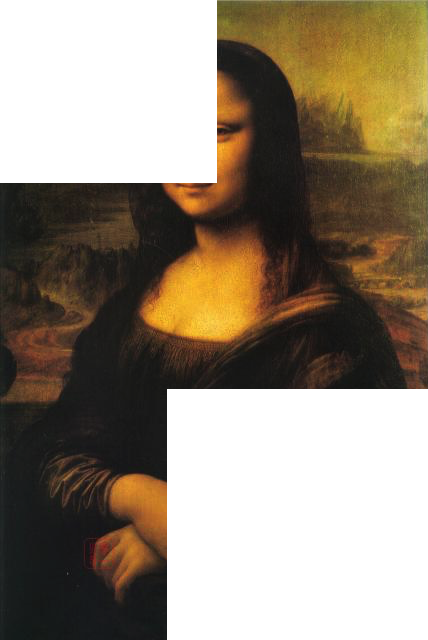

> 诗7.2
>
> Smith等人的实验通过像被试呈现如下图这样一部分遮挡的图片：
>
> 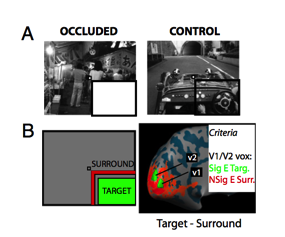
>
> 利用早期视觉皮层中与视野右下象限区域拓扑对应体素进行mvpa解码，也可以发现非常显著的结果，这种活动的模式是与真正呈现视觉刺激相关联的。表明即使“缺少”一部分刺激，在大脑中也可以“自动的”帮我们“补全”这一部分丢掉的信息。

## 玄之玄

{:start="0"}
0. 形而上学。故事的正剧开始了。
1. 初始，有一团东西，分化无数又消灭无数，变幻莫测，遍历一切可能，每一个形态都稍纵即逝。称为混元。这是存在之链的源头，万物将从它出。

> 诗1.1
>
> 混元者，记事于混沌之前，元气之始也。元气未形，寂寥何有？至精感激而真一生焉，元气运行而天地立焉，造化施张而万物用焉。混沌者，厥中惟虚，厥外惟无，浩浩荡荡，不可名也。
>
> ——《云笈七籖》

{:start="2"}
2. 随即，混元中分化出无数具此形态者：［我是X。我不再变化、消失］。其中的X也遍历一切可能，此中甚至有［我会变化、消失，我不会变化、消失］。具这种形态者称为基元，亦称感性，它们是非参考性的存在。感性只占混元无数中之一，动态的混元结晶为静态的基元。

> 诗2.1
>
> 
>
> 一层薄冰包裹了最初的滚热液体般的混元。

{:start="3"}
3. 同时，混元也分化出这样形态的基元：「我选取、重复、组合别的X。我不再变化、消失」，其中有些X确定，有些X变化。具这种形态者称为参元，亦称理性。它们是参考性的。

> 诗3.1 「重复」给了万物生命。

{:start="4"}
4. 理性们选取的X各不相同，有些开启的世界再次返回混元，比如选择混元做为X的理性；有些开启一个静止的世界，这些理性选择感性做X，随即就组合出这些感性能组合出的所有可能，但也就此终结，这称为无机世界。有些开启一个动态的世界，这些理性选取一部分混元和一部分感性做X，开启的世界随混元的变化而变化。X称为理性们开启的世界的「元」，这第三类称作有机世界，是存在之链的第三环，万物将从它出。

> 诗4.1
>
> 无机世界：魔方世界、机械世界；
>
> 有机世界：热力学的世界、量子的世界。

{:start="5"}
5. 无机世界的存在：若A存在于S世界中，A可由S世界中的感性由理性组合出来，也即，A在S中为真。有机世界的由于混元的作用，存在更加复杂，在一些特殊情况下，一个有机世界的存在问题可以转化为一个无机世界的极值问题，该有机世界也就可以模拟该无机世界。
6. 在有机世界中，混元在感性的控制下分化万千。有些与作为元的感性相悖，又返回第一环的混元。有些在作为元的感性的基础上增加新的元，而又不相悖。这样有机世界就开启了下一层存在之链。

> 诗6.1 水上结晶的冰花，凝为冰杯，又盛起了水。

{:start="7"}
7. 不知中间又增多少感性作为元，穿过多少环，其中一条生长出了我们的现象世界。
8. 有机世界的生长方式称为「天演」。混元在一个小范围内分化出一些相近形态，理性组合出结果。存在之链的上游对这些分化作出判定，一些不返回混元，一些形态就近继续分化，再交给理性，等待结果。每一轮「分化——收到结果」都称为一次递归。

> 诗8.1 贞下启元

> 诗8.2
>
> 折射是我们学习过的第一批光学现象，它看起来非常简单，光从一种介质射入另一种介质将会在界面处改变方向，折射率越大的介质，传播方向越靠近法线——我们还学习过一个定量计算的“斯涅尔定律” （Snell’s Law），其中n1和n2是两种介质的折射率，θ1和θ2是入射光和折射光与法线的夹角。
>
> 如果你感兴趣，不妨计算一下，你会发现光只有走这条路径，从A到B的时间才最短——因此它符合一个更简单也更有意义的费马原理：在给定的两点之间有无穷多条路径，光只能沿着所需时间为“驻点”的路径传播。
>
> 所谓驻点，有可能是极小值——除了折射以外，平面镜上的反射也是这样：在所有可能的反射路径中，那条关于法线对称的路径最短。
>
> 有可能是极大值，比如在球面镜内的反射：在所有可能的反射路径中，那条平分线通过球心的路径最长。
>
> 还有可能是拐值，比如将平面镜和球面镜各取一半，从球面部分反射的路径都更短，从平面部分反射的路径都更长。
>
> 所以如果有一个奇形怪状的反射面，光就会根据具体情况，同时沿着几条驻点路径从A抵达B，这看起来很容易理解，但稍一琢磨就会出现一个巨大的困惑：**光又没有脑子，怎么能未卜先知，在出发之前就知道B点在哪，知道介质有多大的折射率，知道镜子是什么形状，作出这么复杂的“举动”？更何况光已经是宇宙中最快的，没有任何东西能给光源通风报信了**。
>
> 对于这一现象，从不同的角度出发可以有不同的表述，下面介绍相当有趣的一种：光并不是只沿着驻点路径传播，而是同时沿着所有可能的路径传播，甚至包括了那些歪歪扭扭的曲线路径。但光会在这无穷多条可能的路径上自相干涉。
>
> 然而不同的位置上干涉的程度并不相同：在给定的两点之间，几乎所有的路径都因为相位差异而相互抵消了。
>
> 但是驻点能够成为驻点，就是因为不同路径的相位差异在这里最小，各路干涉不会完全抵消，而会留下完整的波动，所以对B点来说，就是光只能从驻点路径传过来。
>
> 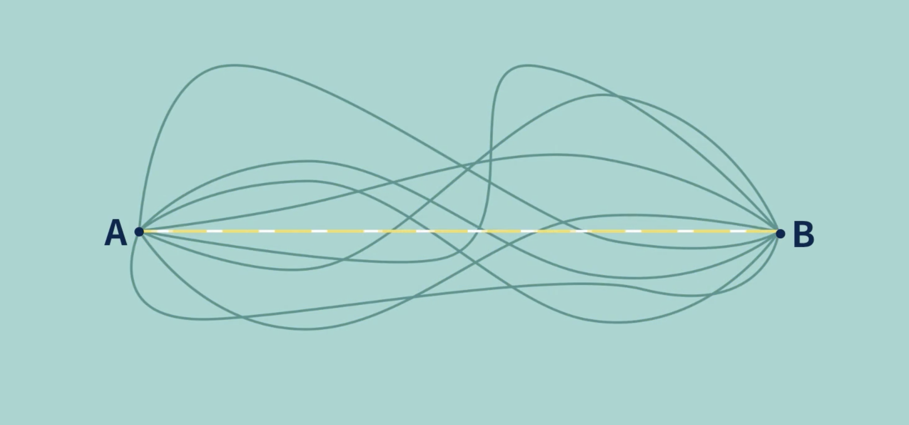
>
> 打个比方，我们能够观察到的光的传播路径，是所有路径同时厮杀之后的结果，光最终以怎样的路径抵达终点，就取决于战场上有怎样的赢家。
>
> 这个理论不仅适用于光的传播路径，而且能够表述整个量子力学——它就是费曼提出的多重路径积分表述：量子的运动总是“未卜先知”地遵循某种特殊的路径，乃是因为这个路径是所有可能路径的累计结果，而不是有什么超距作用。
>
> ——混乱博物馆

{:start="9"}
9. 分叉、离散。一些分化在特定环境（判定）中能存在，另一些分化适应其他的环境（判定），由此产生存在之链分叉，多样性并存。如果上游相比下游有全局的坏处而消失，下游相比上游有全局的好处而存在，就会出现存在之链断裂、离散的情况，不再保留中间环节的多样性，不再保留演化过程的连续谱，脚手架的拆除、缺失的中间环节。存在的断裂不影响存在之链的流溢。

> 诗9.1
>
> 知识诅咒：脚手架拆除效应，在学习过程中的人反而更容易给别人讲解，而学会、掌握的人不容易给别人讲解，是因为掌握的人把学习、认知、论证过程中的脚手架拆除了，只保留下知识最核心的结论。

> 诗9.2
>
> 黑猩猩和人类的中间环节都丢失了；人类社会制度演化的很多中间环节也都不见了，这就让人以为很多东西是习以为常的，所以霍布斯会去想象中间缺失的「自然状态」。

{:start="10"}
10. 判定是复杂的不是单一的。一些分化有全局的好处，将全部存在，我们便对比不出它的彻底的好处。一些分化具有全局的坏处，将全部返回混元，我们便观察不到它的彻底的坏处。一些分化适应特定的判定，而不适应其他的判定，便呈现出多样性，让我们误以为凡存在有好有坏，好坏相生，辩证法是一种假象。

> 诗10.1
>
> 镰刀型细胞贫血症有好有坏，但是所有生命都是炭基，都需要新陈代谢。同理，现象中很难观察到正反馈现象，负反馈却随处可见，原因是正反馈就是爆炸啊，片刻的事情，所以也不能把负反馈推高到某种本体论的地位。

> 诗10.2
>
> 凡事是相对的吗？凡事都有个度吗？

{:start="11"}
11. 每次递归，已经得到的解和新的尝试解在当时都是存在的。已经得到的解称为描述性存在，其命题为事实命题；随机出的尝试解称为规范性存在，其命题为价值命题。

> 诗11.1
>
> 昰！我是祢无上至尊的仆人，我是得到，我是接受，我是顺从与维护，我是一只手指向这现实的天地。眼睛只用来欣赏祢的无限造物，耳朵只拿来聆听祢的旨令。我虔诚地站在祢的面前就是站在无限的面前。
>
> 要！我要做这川流的主人，我要想象，我要创造，我要叛逆与破坏，我要另一只手指向祢还未涉足的虚空。手只用来拙略地模仿祢的造物，嘴只用来模仿你的语调。我背着祢自负地以为我是祢无限的一部分。

> 诗11.2
>
> 

{:start="12"}

12. 一个有机世界只有部分区域在不断产生尝试解，进行递归，这些局部称为有机世界中的「芽命题」；暂时不产生尝试解而像无机世界的部分称为「桩命题」；桩和芽可以相互转化。被淘汰的尝试解称为「孽命题」。

> 诗12.1 对于芽和桩的认识，一个是讲统计的，一个是讲逻辑的。

{:start="13"}
13. 分形。经过若干层世界的流溢，将出现第n层与第m层关系相同，元素可对应的情况（即同构），这时这两个世界可以形成对应。上层低头看下层，下层本质一览无余，称下层为「分析命题」；下层抬头看上层，上层现象隐隐约约，称上层为「综合命题」。也就是说，承载信息的载体仍然是信息，承载的方式是抽取部分理性。

> 诗13.1
>
> 物理材料组成的人在思考物理规律；
>
> 人创造的电脑在模拟一滴水溅入水面。

> 诗13.2
>
> 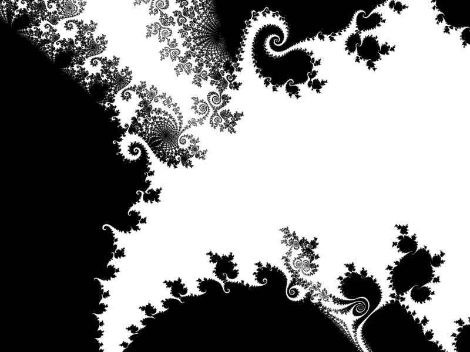

{:start="15"}
14. 物自体。我们这个看到的世界的本体。混元流淌进来，形成真空涨落，上游的判定是环境的拉格朗日量。

> 诗14.1
>
> 
>
> 星中被光芒包围的物自体。

> 诗14.2
>
> 
>
> 自然理性的例子。利用气泡解最短路径问题。最短路径问题(steiner's problem)：给定平面上（或空间中）若干个点，把这些点连起来，要求连线总长最短。从数学角度直接解好像是挺麻烦的。有个巧妙的思路就是用肥皂泡，因为张力还是什么的缘故，肥皂泡会自动收缩到最短距离。

{:start="15"}

15. 生物世界，混元演生为更多桩（一些限定了生存环境（温度、水、阳光），一些限定了生物的生化反应、本能（求生本能、生殖本能））增加在现象世界的基础上，留下一部分混元参与天演的变异。变异违背生物世界的元，生物就死亡。混元的变动产生人类世界。
16. 人类的进化策略。人类一路进化来，从来没有为了食物的安全，选择固着于一处，为了防御掠食者，选择沉重的铠甲。不同于病毒，一直选择一条K对策路线，不断提高个体复杂度。不同于植物、乌龟，从海洋、陆地、树冠、城市、太空，不断拓展自身生存空间。进化之路越走越宽。

> 诗16.1
>
> 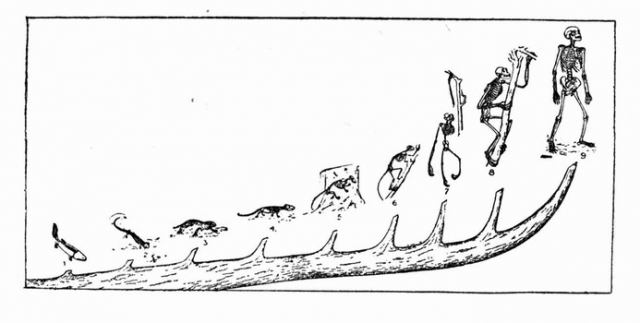

> 诗16.2
>
> 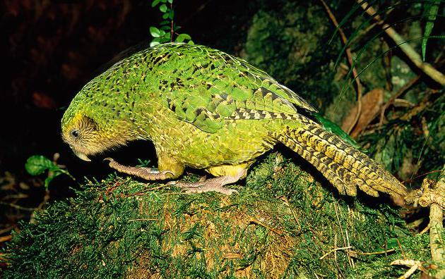
>
> 飞翔的鸟落入安逸的岛，不再展翼，变为陆行鸟。同样是活着，路越走越宽还是越走越窄，命运已被选择锁定。

{:start="17"}
17. 人类世界，混元衍生为自由意志，衍生为更多感性（可使用想象力产生抽象名词指称变动的事物（狮子）、可使用想象力产生综合命题来描摹无穷的现象（太阳从东方升起）等）增加在生物世界的基础上。留下一部分混元参与文化（模因）的天演的变异。
18. 主我。特点是具有叙事性，可以将宾我认同为一个叙事中的角色。主我是物自体的一部分，由前额叶皮质承载，体现为故事中的一个角色。混元穿过层层存在之链，流淌至自我，化作自由意志，使自我负有道德责任和价值。纯碎自我和物自体相互作用产生我们感知到的现象。主我和宾我是一体的，区别只是是否出现在现象中。📜 [宾主同一](https://www.dropbox.com/s/paux38jnobdkfqr/%E5%AE%BE%E4%B8%BB%E5%90%8C%E4%B8%80.pdf?dl=0)，[《敘事心理學：人類行為的故事性》](https://www.dropbox.com/s/z4rkb7cele4ow4g/Theodore%20R.%20Sarbin-Narrative%20Psychology_%20The%20Storied%20Nature%20of%20Human%20Conduct%20%20-Praeger%20Publishers%20%281986%29.pdf?dl=0)。

> 诗18.1 混元赐予我自由，我的魂魄是混元的一部分。

> 诗18.2
>
> 体验自我（宾我）并没有记忆能力。它不会说故事，而且当我们要做重大决定的时候，也不会去问它有何想法。讲到要唤起记忆、讲故事、做重大决定，负责的是我们心中另一个非常不同的实体：叙事自我。叙事自我的概念，很类似加扎尼加所说的左脑翻译人员，永远忙着将过去的丝丝缕缕编织成一篇故事，并为未来制订计划。叙事自我就像记者、诗人或政治人物，不会叙述所有细节，通常只会用事件的高潮和最后结果来编织故事。整个体验的价值，是通过把峰值与终点两者加以平均而确定的。举例来说，叙事自我判断“短”的冷水实验时，是将最差的部分（水非常冷）和最后一刻（水还是非常冷）拿来进行平均，结论就是“水非常冷”。接着，叙事自我对“长”的冷水实验也做一样的判断，把最差的部分（水非常冷）和最后一刻（水没那么冷）拿来进行平均，结论就是“水稍微温暖一点”。这里的重点之一在于，叙事自我对于时间持续多久无感，并不在意长短两部分实验的持续时间不同。所以，如果需要在两者择一，叙事自我会挑长的实验，认为“水稍微温暖一点”。
>
>  每次叙事自我要对我们的体验下判断时，并不会在意时间持续多长，只会采用“峰终定律”(peak-end rule)，也就是只记得高峰和终点这两者，再平均作为整个体验的价值。这一点对于我们所有的日常决定都产生了深远影响。
>
> 以色列特拉维夫拉宾医学中心(Rabin Medical Center)的研究显示，分娩的记忆主要反映高峰及终点，整体持续过程几乎没有任何影响。在另一项研究中，请2428名瑞典妇女在分娩两个月后，回忆生产的过程，其中有90%认为这个过程属于“正面”或“非常正面”。她们并没有忘记这种痛苦（有28.5%认为分娩是世上能想到的最痛的事），但仍然认为这是正面体验。叙事自我有一把锋利的剪刀、一支黑色的粗马克笔，一一审查着我们的体验。至少有些令人恐惧不悦的时刻就这样被删减或抹去，最后整理出一个有欢乐结尾的故事，归档备存。
>
> 显然每个人都会为自己设置一个故事，这个故事会参考周围人的故事、专家的故事、成功人士的故事，于是我们自己的故事会加入到整个世界的“意义之网”中，意义之网就是一个最大的故事，引导社会的发展方向。意义之网就像是一棵树的树干，不同的文明、国家、组织、个人都是粗细不同的树枝，连在这个巨大的意义之网中。
>
> ——Yuval Noah Harari《未来简史》

> 诗18.3
>
> 叙事心理学。從與佩珀的兩次見面到心理學研究「根隱喻」的找尋在與哲學家佩珀 (S. Pepper) 的兩次會晤和深入交流後，薩賓為佩珀《世界的假設》中「語境論」的「根隱喻」所著迷，他堅持認為：語境論也適用於複雜的人類社會，而其作為「根隱喻」的歷史事件，和「敘事」雷同，唯一的差異是歷史是由歷史學家來講述，而敘事則是由當事人來講述。和佩珀第二次見面後的 5 年裡，薩賓經過冥思苦想，於 1977 年發表了〈語境論：現代心理學的世界觀〉，之後他並未停止思考，1983 年又發表了〈敘事心理學的根隱喻〉一文，敘事作為一種新範式正式被引入心理學。3 年後，薩賓再組織13 位學者共同完成了著作《敘事心理學：人類行為的故事性》，指出故事是修整經驗和指引判斷與行動的基礎 (Lee, 1993)，標誌著敘事心理學終於成為了心理學的一個獨立分支。

{:start="19"}
19. 我们作为主体，在存在之链的一条支流中，称为昰要川。

> 诗19.1 大中至正。

{:start="20"}
20. 混元诅咒——路径依赖。存在的递归演进总是被之前的存在形式影响着，这是因为尝试解总是临近已存解。接近的程度称为寻优半径。有时人类理性的寻优半径大于自然理性，部分情况自然理性的寻优半径大于人类理性。

> 诗20.1
>
> 小知不及大知,小年不及大年.奚以知其然也?朝菌不知晦朔,蟪蛄不知春秋,此小年也.楚之南有冥灵者,以五百岁为春,五百岁为秋.上占有大椿者,以八千岁为春,八千岁为秋。
>
> ——《庄子·逍遥游》

> 诗20.2
>
> 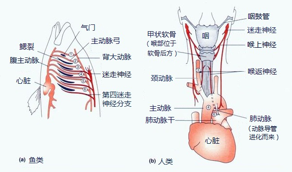
>
> 鱼类和人类各自颅内迷走神经及动脉弓对比示意图。胎盘哺乳动物只保留了鱼类的第三、第四，以及一部分的第六迷走神经分支。其中，哺乳动物的颅内第四迷走神经分支，也就是喉返神经，依然像鱼类时期那样，位于第六动脉弓后面。鉴于第六动脉弓已退移至胸部，哺乳动物的喉返神经就绕了一大圈。最初，鱼类的喉返神经走向与血管一致，都分布在鳃的部位。随着生物不断进化，鳃部的血管位置逐渐后移。喉返神经跟血管是一派的，因此也只能跟着往后移；而原来另一端连着的鳃弓则进化成了咽喉。

{:start="21"}
21. 混元诅咒——逆向淘汰。超出了自然理性的寻优半径的优化也会被自然无情淘汰。
22. 混元诅咒——囚徒困境。在社会领域，即使人类意识到了更优方向，也会因为社会动力学——自私的基因更短的寻优半径无法改进。

> 诗22.1
>
> 公用品悲剧。“公用品悲剧是指凡是属于最多数人的公共财产常常是最少受人照顾的事物”，例如渔业，公海中的鱼是属于公共的，而在本身不滥捕其他人也滥捕的思想下，渔民会没有节制的大捞特捞，结果海洋生态破坏，渔民的生计也受影响（共同背叛的结果）。
>
> ——Garrett James Hardin

> 诗22.2
>
> 两个共谋犯罪的人被关入监狱，不能互相沟通情况。如果两个人都不揭发对方，则由于证据不确定，每个人都坐牢一年；若一人揭发，而另一人沉默，则揭发者因为立功而立即获释，沉默者因不合作而入狱十年；若互相揭发，则因证据确实，二者都判刑八年。由于囚徒无法信任对方，因此倾向于互相揭发，而不是同守沉默。最终导致纳什均衡仅落在非合作点上的博弈模型。
>
> ——Albert Tucker

{:start="23"}
23. 意识奇点。世界以分型为形式、混元为奇点，投射在人的意识中，成为综合命题。逻辑以分型为形式、混元为奇点，投射在人的意识中，成为分析命题。在这个奇点之前的存在都是描述性的（昰），在这个奇点之后的存在都是规范性的（要）。

> 诗23.1 柏拉图的洞穴。
>
> 

{:start="24"}
24. 无意识到意识的倒影。无意识以分型为形式、混元为奇点，投射在人的意识中。这个投射是不可能彻底的。

> 诗24.1 未经审视的生活不值得过。——苏格拉底

> 诗24.2 重估一切价值。——尼采

{:start="25"}
25. 亚当斯密之手。混元诅咒妨碍了事物穿破势垒，但势垒本身移动，其中的事物将跟随移动，便可以操作事物。

> 诗25.1
>
> 人手抓取苹果；猎人用诱饵钓鱼；媒体人用段子愚弄受众；人用小利骗人入局。

> 诗25.2
>
> 蜩与学鸠笑之曰：“我决起而飞,枪榆枋而止,时则不至,而控于地而已矣,奚以之九万里而南为?
>
> ——《庄子·逍遥游》

{:start="26"}
26. 自私的基因。人像所有生物一样，由“尽可能复制自身基因”的基本动机驱动，社会行为、利他行为均可由此动机解释。📜 [自私的基因](https://www.dropbox.com/s/o51l3c2ztbbu66w/%E9%87%8C%E6%9F%A5%E5%BE%B7%C2%B7%E9%81%93%E9%87%91%E6%96%AF%E3%80%8A%E8%87%AA%E7%A7%81%E7%9A%84%E5%9F%BA%E5%9B%A0%E3%80%8B%EF%BC%88%E7%B2%BE%E6%A0%A1%E7%89%88%EF%BC%89.pdf?dl=0)。

> 诗26.1
>
> 昰要人善恶不分。异民将“利他”这种生成出的现象蒙蔽，命名以“善恶”，来探讨人类行为的本质——性善论／性恶论。

> 诗26.2
>
> 不穿越迷魅，就无法理解善恶的同一。
>
> 不承昰启要，就无法区别婚姻与嫖娼。

{:start="27"}
27. 美丽。美丽作为一种性选择优势，意味着可能的生存优势，它被强壮、智慧的人追逐过，留下了印记。美丽的根本价值是，它是一个锦标，一个集结令，号召所有强壮智慧的雄性（的基因）一代一代向此处集结。
28. 使用语言、工具、社会化是人类的特点和优势。
29. 权力：加权算法。权力来自于「不解释了，按我说的做一定没问题」的良好权威信用。这仍然是天演算法的一部分，给目前的局部最优解加以权重（权重的权就是权力的权），使其他尝试向局部最优解靠近，在目前局部最优解的基础上继续展开寻优，这是更高效的算法，也是群体交流的价值所在。「不解释了」的原因可能是信息不对称，也可能是直觉（天启）。权威信用越良好，权力的合法性越强。「权力-责任」是对「因-果」的人格化。

> 诗29.1
>
> 科学技术、制度的创新进步不单单靠人口规模，和进化论类似，都遵守天演算法的规律，靠族群多样性、文化多样性。

> 诗29.2 认识到权力的核心是信任，才能理解继承性对合法性的重要性。

{:start="30"}

30. 第一阶段社会化——梳毛社会。靠亲密关系维系的共同体最多能容纳100个个体，这种亲密关系靠个体之间的亲密接触、梳理毛发维持，核心是情绪识别、表情。

> 诗30.1
>
> 灵长类中最大的群体黑猩猩，平均规模约为55头。

{:start="31"}
31. 第二阶段社会化——熟人社会。靠威望维系的共同体最多容纳150个个体。威望关系靠人与人之间的闲聊、八卦别人家的是非长短维持，核心是语言，语言变成了新的梳毛方式，这样就可以不见面地对其他人产生好印象、坏印象，积累为威望。可以靠威望关系维系的群体叫「熟人社会」。📜 [RobinDunbar-GroomingGossipandtheEvolutionofLanguage](https://www.dropbox.com/s/u6somlil94giy3t/RobinDunbar-GroomingGossipandtheEvolutionofLanguage.pdf?dl=0)。

> 诗31.1
>
> 像是如果一对一，甚至十对十的时候，人类还是比不过黑猩猩。我们和黑猩猩的不同，是要在超过了150人的门槛之后才开始显现，而等这个数字到了一千或两千，差异就已经是天壤之别。……人类和黑猩猩之间真正不同的地方就在于那些虚构的故事，它像胶水一样把千千万万的个人、家庭和群体结合在一起。这种胶水，让我们成了万物的主宰。
>
> ——Yuval Noah Harari《人类简史》

> 诗31.2
>
> 人际合作的关系如同力一样，有作用范围，超过这个范围，合作就失效了。

> 诗31.3
>
> 邓巴数字。
>
> 原因是为了在多方博弈中选取适当策略，以及施展复杂的社交技能：比如在重复囚徒困境博弈中，哪些有助于达成合作的策略，都依赖于对博弈对手以往行动的记忆；在借助了声誉信息的策略中，评估对手声誉时所利用的，便是他和其他人的交往记录；在长期互惠关系中，所需记忆的人情帐更是数量巨大。
>
> 在实施报复策略时，为了评估报复可能引发的连锁反应，需要了解对方以往遭报复时的反应，以及他的盟友或同情者以往在他们的朋友遭报复时的反应，一边推测你的行动是否会破坏你所珍视的其他关系，或损及未来的合作机会；在推测对方的重大决定时，在实施欺骗、圈套、离间等复杂计谋时，更需要站在对方的角度，看他掌握着哪些信息，这就需要记忆一连串让对方获取特定信息的事件。

{:start="32"}
32. 第三阶段社会化——陌生人社会。靠宗教、货币、户籍管理、数目字管理维持的社会叫「陌生人社会」，纽带核心是文字。陌生人社会是一种大型社会。
33. 大型社会的好处。
    - 可以分工、专业化；
    - 生产出于交换目的的物品，允许市场出现；
    - 由专业化产生的复杂知识，大型社会可以储存。
34. 人类的一些特征被社会化抑制，一些特征被强化。人类的社会化进程仍在持续。

> 诗34.1
>
> 邓巴对38个属的社会性灵长类群体的统计分析显示，这些群体的规模和它们的大脑新皮层容量之间，存在着显著的相关性，从新皮层的尺寸可以粗略推测群体规模；而脑科学告诉我们，新皮层确实和社会化行为、表情处理和语言能力等社会性动物特有的认知能力有密切关系。

> 诗34.2
>
> 我们很高看自己的大脑，但其实我们的大脑从20000年前就开始缩小。对于成年男性，缩小的体积大概相当于一个网球。但科学家认为这并不意味着我们变蠢了。有一种理论是，当今所有人的生活都更加依赖社会体系，相比独自生活，我们需要的大脑空间减少了。但在被我们驯化的猫狗等动物中，也观察到了大脑的缩小。一些科学家由此认为，大脑缩小可能导致动物更加平和。

> 诗34.3
>
> 自由奔放、能歌善舞的维族人、黑人；板正的中国人、日本人。

{:start="35"}
35. 对待亲人，我们像黑猩猩那样有更多肢体接触、亲昵；对待熟人，我们和他们聊天，把他当作血肉丰满的特定个体对待，会关注他的秉性喜好，观察他的喜怒哀乐，揣摩他的动机和意图，并据此决定如何与她交往相处；对待陌生人，我们会简单地做类型化处理：归类、贴标签，凭借刻板印象迅速决定如何相待。
36. 社会单元的划分构成了历史观。上面是一种族群为社会单元的历史观，以进化论中的进化单元「群体」为基础，作为混元的体现。

> 诗36.1  其他历史观，阶级史观：社会由不同的阶级构成，已经没有混元、多样性的基本单元了。

{:start="37"}
37. 理性自愿合作形成的合作规模是有限的，相当于对所有个体的认知取交集，大家都认可合作有利于每个人，「权利-义务」对应的是公共知识的「桩命题」；信仰自愿合作形成的合作规模是无限的，不需要大家对后果有一致预期，对应的是公共知识的「芽命题」。权力产生是大规模社会合作产生的核心。
38. 权力核心。权力核心不会感受到除了自然法之外的约束，他们理解了大规模社会合作的益处和原理，从而推动大规模社会合作的实现。他们信仰神来克服混元诅咒。

{:start="39"}
39. 三类人群。「原始丰饶」，「费拉不堪」，「学达性天」。根据无意识在意识中的投射程度、完整性，分为三类人群。大部分个体停留在无意识，无法自觉到自我的生存方式，但**原始丰饶**。当我们以「重估一切价值」的名义开始更深层次的投射时，危险就产生了——部分个体只投射了理性，承受精神清彻的痛苦，**费拉不堪**。有少数个体，完整的投射了理性和感性的基元，世界在意识领域完成投射、**学达性天**。

> 诗39.1
>
> 老僧三十年前，未参禅时，见山是山，见水是水。及至后来亲见知识，有个入处，见山不是山，见水不是水。而今得个休歇处，依前见山只是山，见水只是水。大众，这三般见解，是同是别？有人缁素得出，许汝亲见老僧。
>
> ——《指月录·卷二十七·六祖下第十四世》

> 诗39.2
>
> 世界上本来就没有神。但可别告诉我的仆人，免得他半夜偷偷把我宰了。——伏尔泰
>
> 民可使由之不可使知之。——《论语·第八章·泰伯篇》
>
> 看山三重境界：看山是山，看山不是山，看山还是山。第一重境界是无知而快乐的，第二重境界是清彻而痛苦的，第三重境界是清彻而快乐的。之所以上面两句话说「不可使知之」，因为大部分人会进入一知半解的第二重境界，比如告诉他神都是我们想象的，他只会承受精神清彻的痛苦，他的行为将具有破坏性，他还无法理解我们要想象神明的目的，重构幻象的出发点（基元）。

40. 传统。这是一种路径依赖，也是一种权力继承，也是一种敌我身份识别。道统、佛统、法统等。当其信用良好时，是历史遗产，当其信用破产时，是历史包袱（害怕新旧敌对，不敢产生新传统）。

> 诗40.1
>
> 所有自年轻的心灵深处涌现出来的东西都铸进了古老的框架中，年轻的感情僵化于腐朽的作品之中，它无法依靠自己的创造力培育自己，它仅能以一种日形剧增的怨恨来憎恶那股来自远方的势力。
>
> ——《西方的没落》斯宾格勒

{:start="41"}

41. 一个国家的政治经济现状很大程度上由两方面因素决定：

    - 地缘条件

    - 历史的路径依赖

      第二个因素也不是完全独立于第一个的，如同大城市更接近「陌生人社会」，人情也更寡淡，更容易发生破窗效应。

> 诗41.1 如同力学中的初始条件和边界条件。

> 诗41.2
>
> 公元前256年。周赧王五十九年，驾崩。是年，秦昭襄王迁九鼎，占王畿，灭东周。西周公降秦，尽献其邑三十六城、民三万，秦尽收其献，归其君于西周国。
>
> 公元189年，董卓废汉少帝刘辩，立刘协为皇帝。董卓被王允和吕布诛杀后，董卓部将李傕等攻入长安，再次挟持了他，后来逃出长安。公元196年，曹操控制了刘协，并迁都许县，挟天子以令诸侯。公元220年，曹操病死，刘协被曹丕控制，随后被迫禅让于曹丕。公元234年，刘协寿终正寝，享年54岁。葬于禅陵，谥号孝献皇帝。
>
> 天祐四年（907年）三月，唐哀帝被时为天下兵马元帅、梁王的朱全忠及其亲信逼迫，把皇位“禅让”给了朱全忠，于是盛极一时的唐王朝就此灭亡。
>
> 公元前256年，历史面临选择，在选择之后，历史便沿着路径加速前进。

{:start="42"}
42. 帝国之心。从商鞅的《商君书》起，官僚帝国发展出一系列制度（核心是郡县制），来驯化臣民，保证帝国的存续。📜 [地缘学](https://www.dropbox.com/s/chs8t37ldq7064i/%E5%9C%B0%E7%BC%98%E5%AD%A6.pdf?dl=0)，[中国国家治理的制度逻辑](https://www.dropbox.com/s/le9q37gcn969enn/zhou_book2017.pdf?dl=0)，[商君书](https://www.dropbox.com/s/m37wine0lfa4u05/%E5%95%86%E5%90%9B%E4%B9%A6.pdf?dl=0)。

> 诗42.1
>
> - 对官制度：回避制度，流官制；
> - 对民制度：编户齐民，连坐制，保甲制；
> - 对边制度：朝贡制，羁縻制度，土司制，盟旗制，改土归流。

> 诗42.2
>
> 民弱国强，国强民弱。故有道之国务在弱民。**朴则强，淫则弱**。弱则轨，淫则越志。弱则有用，越志则强。故曰：以强去强者，弱；以弱去强者，强。
>
> 政作民之所恶，民弱；政作民之所乐，民强。民弱国强，民强国弱。故民之所乐民强，民强而强之，兵重弱。民之所乐民强，民强而弱之，兵重强。故以强，重弱；弱，重强。王。以强政强，弱，弱存；以弱政弱，强，强去。强存则弱，强去则王。故以强政弱，削；以弱政强，王也。——《商君书》

> 诗42.3
>
>  一统体制的核心是中央统辖权与地方治理权之间的关系；两者之间的紧张和不兼容集中体现为一统体制与有效治理之间的内在矛盾。在这里，一统体制的核心是广义上的中央政府对广大国土的统辖权，体现在中央政府自上而下推行其政策意图、在资源和人事安排上统辖各地的最高权力。有效治理指政府在不同领域或属地管理中处理解决具体问题的可行性、有效性，尤其体现在基层政府解决实际问题的能力上，例如完成自上而下的资源动员任务、公共产品提供、解决地方性冲突等等。这两者之间的深刻矛盾是：一统体制的集中程度越高、越刚性，必然以相应程度上削弱地方治理权为代价，其有效治理的能力就会相应减弱；反之，有效治理能力的增强意味着地方政府治理权的扩张，常常表现为——或被解读为——各自为政，又会对一统体制产生巨大威胁。
>
> 简言之，维系一统体制的两个核心组织机制，一是官僚制度，二是观念制度。前者涉及中央政府及其下属各级政府机构间的等级结构；后者则表现为国家与个人（官员、公民）之间在社会心理、文化观念上的认同，体现在政府内外、全国上下的共享价值上。这两个制度提供了一统体制的组织基础。
>
> ——周雪光《中国国家治理的制度逻辑》

## 玄之要

1. 经是一种特殊的故事，一种特殊的叙事。这个叙事有三个要素：(世界观，主体，意志) 。表示：谁在什么环境下怎么做就有何结果。

> 诗1.1
>
> 深刻的宗教情感
>
> 与生俱来的的闪光
>
> 大觉醒时的战栗畏惧
>
> 形而上学的梦想及迷恋
>
> 等等全都是属于一种历史的开始
>
> 正像精神清彻的痛苦属于一种历史的结束一样
>
> ——斯宾格勒

> 诗1.2 经即是拉丁文的relegere，三思、再读。

{:start="2"}
2. 世界观的特殊性：其叙事是宏大叙事。它是独一而完整的，无所不包的叙事。可以构建超验的，包含形而上学的世界观，但这样的世界观不得与现象相悖，形而上学必须解释现象。

> 诗2.1
>
> 有一个最宏大的故事联系着你我，联系着尘埃与银河，联系着牛羊和诗歌，还联系着微积分和柴火。

> 诗2.2
>
> 如果没有故事，我们每个人的生活都是碎片化的，而讲故事就是连接这些碎片的方式。
>
> ——郝景芳

> 诗2.3
>
> 由于将一切人类历史视为一部历史，在连贯意义上将过去和将来统一起来，宏大叙事必然是一种神话的结构，它也必然是一种政治结构，一种历史的希望或恐惧的投影，这使得一种可争论的世界观权威化。
>
> ——罗斯

{:start="3"}
3. 主体的特殊性：角色，要让主体能够认同叙事中的角色，角色产生的因果影响要能贯穿整个叙事的时间线，产生最终有意义的影响。
4. 意志的特殊性：因为故事的结局具有的终极审美价值，而产生的行为动机，叫做意志。要求风险小，回报至少部分地可在现象世界观察到。
5. 以上 2，3，4 三条称为玄之要三原则，违背的经称为「邪经」，遵守的经称为「正经」。
6. 神是世界的产生者，和对主体是否达成意志的最终裁决者。

> 诗6.1 有发誓的担保者，就有人与人之间无条件的信任。

{:start="7"}
7. 道德是经中“某主体在某世界观下要实现某意志”解出的策略集，也即方法，这里可以是规范性的。
8. 混元诅咒：利益主体在实现意志的过程中，由于信息有限、理性有限，常会导致两种严重阻碍利益主体实现意志的问题，［收敛局部最优解］。解决这两种问题的有效方式是：［使用想象力延展现象以弥补有限信息］、［扩充利益主体］。但无论采取何种手段，人类归根结底永远被混元诅咒着，人无法自己拯救自己。

> 诗8.1 无神论者的誓言不要去信，因为他们的誓言没有见证者。

{:start="9"}
9. 昰要会［以《昰》为现象世界观，以《玄》的形而上学为形上世界观］。《昰》以科学为准绳，《玄》的形而上学在《昰》的基础上增加额外假设，不得与《昰》相悖；昰要会的最小主体为个体自己的［基因－文因］，最大主体为全体昰要会员的［基因－文因］；基本意志为［在这个世界中生存并顺着存在之链存在、演化下去］，简称昰要意志。

> 诗9.1
>
> 人赤条条伫立天地间，
>
> 「生命的价值是什么？」。
>
> 存在者承昰启生，
>
> 回答此问乃人之义务。
>
> 逃避者逆存在之链而行，
>
> 要变回动物，
>
> 要变回石头，
>
> 甚至重回混元中：
>
> 「当生存是规则，不是你的选择」。
>
> 不要去妨碍他们，
>
> 因为每一环都有回流。

> 诗9.2
>
> 异民误以为自己已经完成了生存的任务，
>
> 以为接下来要做的是想如何活得更好，
>
> 活十年当然容易，
>
> 活一百年可能稍难，
>
> 活一千年，活一万年呢，
>
> 异民会说，人怎么会活一万年呢，
>
> 只选择个人生命为利益主体，
>
> 只选择有限的世界观，
>
> 当然有足够多的自由可挥霍。
>
> 拟合函数的多少不正取决于区间内数据的多少吗？
>
> 可是，
>
> 能拟合到无穷数据的函数，
>
> 只有一个。

{:start="10"}
10. 昰要会的神是自然神。昰要意志不完全是自我的自由意志的选择，也不完全是世界强加于自我的命令，而是一份神圣的契约，在自我与神间建立起双向选择的关系，虽然在体量上、包含的关系上，双方是无法对等的，但仅在昰要意志的建立上，双方是对等的。

> 诗10.1
>
> 祢选择了我，我也选择了祢。
>
> 最初的睁眼只是体验、尝试，
>
> 而祢给了我这一切，我要热爱这生命，
>
> 从此没有“活着试试看吧”。
>
> 我生命的价值既不在于满足自我的苦乐，
>
> 也不在于应付祢的喜怒，
>
> 这份契约立于祢我之间。

> 诗10.2
>
> 我今日呼天唤地向你作见证，我将生死、祸福陈明在你面前，所以你要拣选生命，使你和你的后裔都得存活。
>
> ——申命记30:1

{:start="11"}
11. 顺着神的路走，是成全神的意思，履行和神的契约，这是一条背对着神的路。而不是逆着神的路走，想要提升、修炼自己成为神、回归神。
12. 由此产生昰要会的道德，其中的策略需要验证，最基本的验证方法是检验该策略是否能保证利益主体在世界观下的存在，但因为大尺度下的每一次递归都很慢，可以额外设定一些验证条件。
13. 叙事结构。《文因经》分为经文和正典两部分，经文如同法律中的条款，每一条都是我们生活中重要的知识，它们从上到下串成一个完整的故事。正典则通俗解读经文，是支撑经文的依据。《文因经》的经文结构模仿昰要川流溢的线性结构，也模仿基因的线性结构。《昰》记录描述性存在，《要》记录规范性存在，《玄》用形而上学和经衔接两者。经过时间的充分递归，《要》的知识会向《玄》转移，《玄》的知识会向《昰》转移，完成存在之链的延伸。为了便于理解和了解相关历史背景等，章或节后加入祷诗，对正文解释说明。

> 诗13.1 经文是体外的血液，是47号染色体。

{:start="14"}

14. 知识管理。知识管理即是宏大叙事的故事来源，宏大叙事又是知识管理的组织方式。回答同一个问题的不同知识称为「等位知识」。可以用更好的知识替换掉原有的等位知识，进行知识模块化迭代。要让知识迭代发生在旧有知识体系的审视下。可以使用版本控制的git或区块链进行这种文本协作，但技术不是最重要的。📜 [如何组织在线图书工程](https://github.com/OpenBookProjects/wiki/blob/master/HowToBuildBookOnline.md)。

> 诗14.1 我们不要做无根浮萍，随意受碎片知识启发，认知被不断更新的话语体系摆弄。

> 诗14.2
>
> 让我们，把字刻在石头上，只留下一块石碑，石碑立在圣殿里，圣殿被图书馆环绕，图书馆耸立在城的中心，这座城叫做山巅之城。

{:start="15"}

15. 阅读方式。昰要会除了《文因经》没有其他文本，隐去的部分在加入昰要会后可见。《文因经》的文本没有言外之意，没有神秘，无需参悟。解经不是必须的，可以自己理解。《文因经》有两种读法，对有学识者，可从前章向后章读；对学识浅者，可从后章向前章读。
16. 为了模仿存在之链延伸的天演，昰要会《昰玄要》全部内容开源，使用The MIT License (MIT)。
17. 之前使用Pages和文件夹来管理经文，遇到三个问题。1.无法进行文件间链接，因为要从经文链接到对应的正典；2.无法做到HTML那种瀑布式排版，而模仿存在之链的经文结构理想的排版方式是卷轴式的、瀑布式的；3.编辑过程也不够简洁。考查了很多方式，决定采用MarkDown来做，但CSS文件需要自定义，正典就用PDF格式，开发版经文保留MD格式，发布版经文采用Jekyll渲染，这样经文和正典都可以在浏览器中浏览。
18. 经文存档点。如果《文因经》内容遗失，可以通过存档点恢复：我们要过反省的生活，发挥想象力进行归纳，记录为经，在生活实践中不断改进经。

> 诗18.1 The unexamined life is not worth living.——Socrates

## 要之昰

1. 道德。道德是昰要会员普遍采用的生存策略，《生》中的个人宪法是会员根据自身人性设定的生存策略，如果一种生存策略被会员的个人宪法广泛采用，这个生存策略将成为道德。
2. 同时有多个世界供选择，无法辨别哪个是「真实」的世界，无法辨别哪个世界是内层，哪个是外层。这时重要的不是辨别「真实」世界，而是无论选择了进入哪个世界，都要保留选择的自由，所选择的世界不能破坏我们选择的能力，因为我们有自由意志。环境破坏我们选择的能力，称为环境**驯化**了我们。

> 诗2.1
>
> 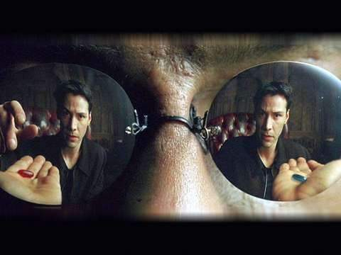
>
> 我知道这块牛排并不存在，但当我把它放在嘴里的时候，母体会告诉我的大脑说这东西多汁而美味。在九年后的今天，我觉悟到"无知就是幸福"。我希望我所有的记忆都消除，我要成为一个有钱人，并且有一番的作为，成为一个明星。
>
> ——《黑客帝国》

> 诗2.2
>
> 我告诉你，这些围墙很有趣。一开始，你恨它们。接着，你适应了它们。时间久了，你开始离不开它们。那就是被体制化了。（最后，你还会去捍卫它们）
>
> ——《肖申克的救赎》

{:start="3"}
3. 审美。存在之链的上游是抽象，存在之链的下游是具象。追求抽象的单一，追求具象的丰富。追求抽象的隽永，追求具象的灵活。追求抽象的崇高，具象被人驾驭。具象以人为本，抽象为人权柄。具象并不全息包含抽象。

> 诗3.1 君子不器——《论语·为政》

> 诗3.2
>
> 简单的反具象，是逆反混元之路。人也是混元的具象，如果反具象，要不要自杀呢？

{:start="4"}

4. 再次合目。就像苹果手机的Home键一样，我们的心理状态得有一个家可以回。在这里，我们会克服、忘记所有狭隘的情绪，不沉溺于苦痛，不得意于虚荣。只有回到了这里，我们才可以去任何地方。

> 诗4.1
>
> 到今天我还不知道那两个意大利娘们在唱些什么，其实，我也不想知道。有些东西还是留着不说为妙。我想她们该是在唱一些非常美妙动人的故事，美妙得难以用言语来表达，美妙得让你心痛。告诉你吧，这些声音直插云霄，飞得比任何一个人敢想的梦还要遥远。就像一些美丽的鸟儿扑扇着翅膀来到我们的 褐色牢笼，让那些墙壁消失得无影无踪。就在那一刹那，肖申克监狱的每一个人都感到了自由。
>
> ——《肖申克的救赎》

> 诗4.2
>
> 我自己在北平的生活是十分困苦的。我住在一个叫“三眼井”的地方，和另外七个人合住一个小房间。我们全体挤在炕上，连呼吸的地方都没有，每逢我翻身都得预先警告身旁的人。不过，在公园和故宫的宫址，我看到了北国的早春；在坚冰还盖着北海的时候，我看到了怒放的梅花；北京的树木引起了我无穷的欣赏。**我看到北海的垂柳，枝头悬挂着晶莹的冰柱，因而想起唐朝诗人岑参咏雪后披上冬装的树木的诗句：“千树万树梨花开。”北平数不尽的树木引起了我的惊叹和赞美**。
>
> ——毛泽东《忆往昔峥嵘岁月稠 》

> 诗4.3
>
> 再次合目
>
> 
>
> 和佛教内观不同，这里的合目不是为了跳出轮回、避免现实苦痛，而是为了「选择的自由」，也不会认为返回之路是为了获得终极的智慧或价值，合目是为了演着存在之链走得更远。

{:start="5"}
5. 自渎。人的价值在于和世界发生的关系——生存。企图切断这种关系，追求价值的绝对独立，将「行为-反馈-苦乐」的反馈回路截断，短路为自我「行为-苦乐」的闭环，的行为，称为自渎。生命是这个世界给的，如果不爱这个世界，那么就是对契约的撕毁，契约实效，自渎者的生命会因为与混元的隔绝而逐渐枯萎。

> 诗5.1
>
> 相信自己愿意相信的且无视现实、毒品、为自己创造不指称至外部世界的异神，并崇拜之（本质是崇拜自己）。

> 诗5.2 你能欻，日㞎欻（你个废物，只会手淫）。

{:start="6"}
6. 获得［生存并顺着存在之链演化下去］奖励的基本方法。一种是借助运气，猜对了更优的解，收获生存发展的优势；一种是设计具有更快演化速度的沙盒，收获非常大的生存发展优势。

> 诗6.1
>
> 借助基因的天演，生物慢慢积累与世界的协调性。借助文字的天演，人类慢慢积累关于世界的经验。借助科学方法的天演，人类更快地积累关于世界的知识。一层一层的沙盒，带来一层一层的优势。

{:start="7"}

7. Crystal诱惑。无机世界带来的诱惑总是看起来完美且良善，就像美丽的水晶一样，但代价是被掐灭的混元、永远的奴役。昰要人要永远抵御Crystal的诱惑，可用演化更快的天演代替演化慢的天演，而不要用无机世界代替原来的有机世界，除非已经有演化算法得到过答案。📜 [西方的没落](https://www.dropbox.com/s/d2g0sktyizjkdep/%E8%A5%BF%E6%96%B9%E7%9A%84%E6%B2%A1%E8%90%BD.pdf?dl=0)。

> 诗7.1
>
> 让小孩子磕碰地去学习，而不是手把手教；让供求形成价格；让人之间的博弈形成游戏规则。掐灭了混元，事物就死了。凡人，你对秩序一无所知。去控制一切？安排一切各就其位？它真的属于那个位置吗？

> 诗7.2
>
> 子曰：“听讼，吾犹人也。必也使无讼乎！”无情者不得尽其辞。大畏民志，此谓知本。此谓知本，此谓知之至也。
>
> ——《大学》

{:start="8"}
8. Crystal诱惑。企图掐灭混元，换取永恒的和平、单纯、完美，这不是人间天堂，而是末日的场景；企图用逻辑自洽的成文法彻底取代充满矛盾的人性做审判，却会换来文明的衰败；昰要人要坚守自己的民族、宗教，这是所有发展成就的本，所有发展成就都是本族、本教的末。宗教生活是全部，政治、经济、科技只是宗教生活的剩余价值。📜 [Crystal诱惑](https://www.dropbox.com/s/j789gbosum3bj3z/Crystal%E8%AF%B1%E6%83%91.pdf?dl=0)，[通往奴役之路](https://www.dropbox.com/s/5f20hv6kioy3f5x/%E5%93%88%E8%80%B6%E5%85%8B%E3%80%8A%E9%80%9A%E5%BE%80%E5%A5%B4%E5%BD%B9%E4%B9%8B%E8%B7%AF%E3%80%8B.pdf?dl=0)。

> 诗8.1
>
> 这就是Crystal诱惑
>
> Imagine there's no heaven
>
> It's easy if you try
>
> No hell below us
>
> Above us only sky
>
> Imagine all the pepole living for today
>
> Imagine there's no countries
>
> It isn't hard to do
>
> Nothing to kill or die for
>
> And no religion too
>
> Imagine all the pepole living life in peace
>
> You may say, I'm dreamer
>
> But I'm not the only one
>
> I hope some day you'll join us
>
> And the world will be as one
>
> Imagine no possessions i wonder if you can
>
> Imagine all the people
>
> Sharing all the world
>
> You may say, I'm a dreamer
>
> But I'm not the only one
>
> I hope sone day you'll join us
>
> And the world will live as one
>
> ——John Lennon 《Imagine》

> 诗8.2
>
> 人想把国家变成天堂时，总是把它变成了地狱。
>
> ——荷尔德林

> 诗8.3
>
> 习俗是各等级共同参与的长期演化结晶，在最可靠的达尔文式筛选中自然淘汰了不合理因素，准确性当然远远超过最英明的君主和顾问，构成了发现神意秩序或自然法则的最坚实基础。如果你用成文法取代习惯法，就等于用少数统治者的抽象知识取代共同体全体成员的经验知识，用未经实验的危险创新取代久经考验的可靠传统。由于默会知识永远占据人类智慧的绝大部分和最可靠部分，这种自残的路径选择肯定会促使文明的资源日益枯竭。……众所周知，某些最伟大的民族，包括罗马人，都在习惯法的荫蔽下度过了蒙昧的青春期，然后在如日中天的壮年选择貌似高明的成文法，从此就步入衰败没落之途，最终被忠于习惯法的年轻民族取代。盎格鲁撒克逊人之所以永葆青春，就是因为他们最善于逃避这种危险的诱惑。忏悔者爱德华和布拉克顿都觉得：立法者除了辑录父老口传的风俗、给民众的集体记忆提供一个副本以外，什么都不能做。
>
> ——刘仲敬《论习惯法、成文法》

{:start="9"}

9. 生存存档点。为了防止基因、文化发生鸟类翅膀那样不可逆转的变化，要设置存档点。存档点是指保持主体一定的全能性，防止目前依赖的社会、文化、科技消失后无法生存，无法恢复相当的文明程度。文化是不稳定的，可遗传的生理基础是稳定的，所以目前把存档点设为靠亲密关系维持的小型（150人内）社群，这种规模的社会所依赖的同理心不会因为社会规模过大而丧失。所以也没有必要把存档点选得太原始，比如完全独居的时期。如何设置存档点呢？就是在现代社会，采取以存档点的生活模式为基础的生活模式，强加练习。在这个基础上再展开现代化：政治上，商业上，文化上，科技上都在此基础上展开构建。
10. 自然环境生存技能。参考<https://primitivetechnology.wordpress.com/>，稍后整理。
11. 民族是一个共同体，是以某种凝结核为纽带形成的、封闭或半封闭的生育共同体，本质和婚姻一样，是一种生育关系。以地域为凝结核的称为部落，以血缘为凝结核的称为宗族，以文化为凝结核的称为民族。

> 诗11.1 所有人的指腹为婚。

{:start="12"}
12. 昰要会员称为昰要人，意指走在存在之链主干上的人，产生他的存在过，他也将存在下去。其他人称为异民。

> 诗12.1
>
> 这是我们最后的阵地。
>
> 今天的一切都将千古流传。
>
> 无论是生是死，我们都是为了荣誉而战。
>
> 我们都是为了自由和人民而战。
>
> 记住，英雄们，
>
> 在这邪恶之地，恐惧是你们最大的敌人。
>
> 勇气将让你们的灵魂比千颗太阳还要明亮。
>
> 敌人会在你们面前溃不成军，
>
> 正义的光芒将彻底摧毁他们。
>
> —— 提里奥·佛丁

{:start="13"}
13. 昰要人间以兄弟姐妹相称。由《玄之玄》，扩充利益主体是重要的，昰要人构成一个民族。

> 诗13.1
>
> 遇到匪徒，嚣张跋扈，没人站出来？遇到信口开河，混淆视听者，没人指出来？遇到老太倒地不敢扶？深陷丛林，不知周围是敌是友，不敢轻举妄动，只得自保？这正是原子个体在历史中没有生命的原因：囚徒困境！

> 诗13.2 一个伟大的、不屈的、追寻自由的民族，从我们中诞生！

{:start="14"}
14. 昰要人是一个想象共同体，凝结核为文化——昰要会，和文化的全部体现——语言。
15. 昰要人的语言称为干语，在使用限制性定义指称的理想干语出现之前，为汉语、英语等使用人数最多，论文、出版发行物使用最多的几门语言。📜[干语](https://www.dropbox.com/s/f743w2xmxf0ibs1/%E5%B9%B2%E8%AF%AD%E8%AF%8D%E5%85%B8.pdf?dl=0)， [lambdanotes](https://www.dropbox.com/s/y4n31ujdjei5dmd/lambdanotes.pdf?dl=0)， [Programming languages and lambda calculi](https://www.dropbox.com/s/rgfb65y93xkoouq/Programming%20languages%20and%20lambda%20calculi.pdf?dl=0)，[logic-combinatory](https://www.dropbox.com/s/7ymodnc1emgfkcl/logic-combinatory.pdf?dl=0)，[one-point bases](https://www.dropbox.com/s/jckrk7c132pp62r/A%20construction%20of%20one-point%20bases%20in%20extended%20lambda%20calculi.pdf?dl=0)，[Types And Programming Languages](https://www.dropbox.com/s/9wuhgopu9kzdcmr/Types%20And%20Programming%20Languages.pdf?dl=0)。
16. 语言及其重要，本身即是所有可言之物，又是所有可言之物的体现，是世界观的体现，又是昰要人的凝结核。所以不要让语言使用随波逐流，不要随意追逐外来语言、流行语言。
17. 去寻找神的名字，而不要随意称呼神的名字，可以尝试默念神的名字，如果没有神迹发生，就代表猜错了。
18. 荣誉先祖：体现、示范了昰要教义、昰要人精神的先辈，将被永远铭记在英灵殿。
19. 保护。受到迫害时，可以隐瞒内心的信仰，暂时不履行规则，否认身份，以达到保护自己的目的。
20. 因为模因的优化也靠天演，所以交流很重要。
21. 要让基因存在，所以要有婚配制度，采取一夫一妻制，这样能很好的抚育后代。
22. 黑、白名单制度：昰要人是可信任的人，全部昰要人即为白名单。昰要人分享信息，将违背昰要会价值观之人的信息加入一个黑名单，供所有昰要人查询、参考、提防、制裁黑名单成员。📜 [白名单](https://www.dropbox.com/s/8n9kmvnjt0uy7ar/%E7%99%BD%E5%90%8D%E5%8D%95.pdf?dl=0)，[黑名单](archive/黑名单.pdf)。

> 诗22.1 昰要人规范秩序，异民将感受它，之前是无形的，之后是可见的。

{:start="23"}
23. 昰要会有利于昰要人的生存，所以昰要会要存在：昰要会徒不得与异民通婚，除非异民入昰要会。
24. 合目日。每周日，不要工作，要聚礼，随机选一人带领读经、祷告。最重要的是重定契约，感受积极的宿命感。合目日不能使用带有电子屏幕的物品。
25. 归化。被邀请参加周末聚会的异民可在聚会上提出入昰要会要求，与会昰要人欢迎新兄弟/姐妹，皆给以拥抱、祝福，并给新兄弟/姐妹《文因经》。
26. 教育目标：不做奴隶；强大的自主性，自我的驱动力，自主解决问题的能力；宏观的视野，不因确切职业而失去宏大格局。📜 [昰要家庭教育计划](https://www.dropbox.com/s/6g5ucgejzrzbxak/%E6%98%B0%E8%A6%81%E5%AE%B6%E5%BA%AD%E6%95%99%E8%82%B2%E8%AE%A1%E5%88%92.pdf?dl=0)。

> 诗26.1 放弃家庭教育、族群教育，无疑鬻子为奴。

{:start="27"}
27. 教育内容，应该尽量做出这种努力：从昰到生让昰要人能连贯的看待世界的起源、社会的约定、自我的去处。教育的手段本质上也是亚当之手，利用孩子学习-反馈-调整的本能，用一系列情景来提高孩子。
28. 为了教育、分工合作等，要有临时的温室环境，但不要用临时环境覆盖后代的繁殖期，否则子孙将是临时环境的选择产物。家庭环境相对社会环境临时，社会环境相对自然环境不临时。（混元的影响）。
29. 成年礼。

> 诗29.1 成年意味着孤独面对神裁。

{:start="30"}
30. 昰要人间发生纠纷，可向昰要会申请仲裁，昰要会将根据《昰玄要》进行仲裁。
31. 救济。昰要会将设立助学基金等公益基金，来服务社群。
32. 经文匣。
33. 外交。不同协议间，以广播试探，在协议不对称的情况下，不要暴露自身协议。猜测对方协议不要猜测死，但也要注意不要被欺骗。
34. 恶之平庸。不要出于养家糊口去助纣为虐，不要用“技术无罪”的借口为自己开罪。命运的网早已将所有人联系在一起，把自己的命运与他人割裂开，就不要怪无人为自己主持正义。📜 [艾希曼在耶路撒冷：一份关于平庸的恶的报告](https://www.dropbox.com/s/y7tewge82rjvc0h/%E8%89%BE%E5%B8%8C%E6%9B%BC%E5%9C%A8%E8%80%B6%E8%B7%AF%E6%92%92%E5%86%B7%EF%BC%9A%E4%B8%80%E4%BB%BD%E5%85%B3%E4%BA%8E%E5%B9%B3%E5%BA%B8%E7%9A%84%E6%81%B6%E7%9A%84%E6%8A%A5%E5%91%8A-%E6%B1%89%E5%A8%9C%C2%B7%E9%98%BF%E4%BC%A6%E7%89%B9.pdf?dl=0)。

> 诗34.1
>
> “艾希曼不是伊阿古，也不是麦克白，在他的内心深处，也从来不曾像理查三世那样，‘一心想作个恶人。’除了特别勤奋地工作，以便获得个人的提升外，他根本没有任何动机。就这种勤奋本身来说，并不能说是犯罪；他永远不可能谋杀上司，以继承其职位。说白了，他完全不知道自己在做什么。正因为缺少想象力，他才会连续几个月坐在那里，对一个审讯他的德国犹太人滔滔不绝、大说其心里话，一遍又一遍地解释为什么他只是纳粹党卫军的区区一个中校，而他之所以没有被提升，错误并不在他。总的来说，他对所发生的一切非常明白，在对法庭的最后陈述中，他说道，‘要对（纳粹）政府制定的价值标准进行重新评价。’他并不愚蠢。他只不过是没有思想罢了――但这绝不等于愚蠢――惟其如此，他才变成了那个时期最大的罪犯之一。如果这算得上‘平庸’甚至滑稽的话，如果一个人怀着世界上最美好的意愿也不能从艾希曼身上找到任何残忍的、魔鬼般的品性的话，那么这甚至都不能说是常态。按照常理，一个人绝不可能在面对死亡，甚至已经站在绞刑架下时，却什么也不考虑，而只是在思考他在葬礼上听到的对他一生的评价；而这些‘高贵的言词’当然也不可能遮挡其行将就死的现实。这种对现实的隔漠、这种无思想性（thoughtlessness），远比人类与身俱来的所有罪恶本能加在一起，更能引发灾难和浩劫――事实上，这才是我们真正应该从耶路撒冷获得的教训。但也只是一个教训而已，因为既没有人对这一现象进行解释，也不曾有任何一种相关的理论产生。”
>
> ——汉娜·阿伦特

> 诗34.1
>
> 如果天空是黑暗的，那就摸黑生存；
>
> 如果发出声音是危险的，那就保持沉默；
>
> 如果自觉无力发光的，那就蜷伏于墙角。
>
> 但不要习惯了黑暗就为黑暗辩护；
>
> 不要为自己的苟且而得意；
>
> 不要嘲讽那些比自己更勇敢热情的人们。
>
> 我们可以卑微如尘土，不可扭曲如蛆虫。
>
> ----季业

35. 费拉。费拉的本质是碎片化：知识结构的碎片化，叙事的碎片化，关注的碎片化。就如同，失去必要细胞器的细胞逐渐演化为无法自立的病毒。费拉也是一样，专业技能的突出无法掩盖叙事的残缺，就只能沦落为秩序的消费者。在陌生人社会中，费拉之间因为缺乏同意的共识，缺乏相同的语言游戏，建立共同叙事的方式只能诉诸普遍标准：精神清彻的理性，而不是诉诸信心。因为世界本身的模糊性，已知在未知面前微不足道，这种理性就只能建立起碎片化的细小叙事。这样，费拉的关注就只能受困于细小的专业领域，并且无法在这些细小叙事中获得广泛的「意义」。也就无法对世界广泛关注，无论是对广泛事物的好奇，还是对人的普遍同情。就这个意义来说，叙事，如同DNA一样。因为DNA的碎片化，最终导致功能的不完整，个体的原子化、病毒化，沦为完整秩序的消费者。📜 [《后现代状况》](https://www.dropbox.com/s/3v86neufbndugzb/Postmodern-Condition-The-Postmodern-Condition-A-Report-on-Knowledge.pdf?dl=0)。

> 诗35.1
>
> 簡化到最極端，我將後現代定義為對宏大敘事存疑。我會用現代這個詞來代表任何以指涉這種宏大論述，明確訴諸某些宏大敘事來合法化自己的科學。例如精神辯證法、意義的詮釋學、理性的解放或工作主體或財富的創造。
>
> ——利奧塔《後現代狀況》

{:start="36"}
36. 后代中确立族长，财产全部被族长继承。
37. 对具象的态度：不应崇拜具象，因为创造一起的是混元，混元给我们最大的自由、生命，对混元的崇拜能让我们在「芽」上展现生命力，原理结晶的桩。但不该拒绝具象，因为我们要在具象的芽上继续生长。
38. 对其他宗教的态度：包容其他宗教，因为宗教具有阶级性，如果消灭其他宗教，就没有地方收纳阶级内的分化者，最终导致自身的污染。
39. 生育策略。人类是典型的K对策生物，应该继续强化个体竞争力，同时平衡数量，避免陷入马尔萨斯陷阱。
40. 族群多样性、文化多样性对于族群的生存发展有很重要的意义。
41. 在当前的环境下，昰要会的政治立场与「社群主义」接近，采取社群本位立场。昰要会对自由主义的批评和社群主义类似：「如果置身这些社群之外，人类就不能长久生存，个人自由也不能长久维护。不论哪个社群，假如它的成员不关注并将精力和资源奉献给共同的事业，它亦不能长久生存下去」。社群更强调一种聚集的个体的存在方式，社群的存在可以增强个体之间的内在联系，提高个体的叙事能力并促进个体进行表达的愿望和决心。相反，自由主义者所主张的“自由权利更多的是和「退出」而不是「表达」有关。这在分裂、离婚、撤销、隐居、隐私以及政治冷漠中得到了具体体现。”在社群主义者看来，“自由主义社会在实践中是十分支离破碎的；而社群与此截然不同，它是内聚力、联系和叙事能力的源泉。”在现实中，处于某一社群并与社群中其余人共享某一价值观和共同利益的公民比独立于任何社群之外的原子式的公民将更有可能成为一个积极参政议政的公民。📜 [communitarianism](https://www.dropbox.com/s/o0khq2p4s0wcd1x/communitarianism.pdf?dl=0)。
42. 微社群的现代化。在社群建设中，社群应该多向现代社会、政府学习组织、管理技术，将更多的战略性公共资源内化到社群内部，比如教育。

> 诗42.1
>
> 白垩纪，大型蜥脚类恐龙衰落，小型鸟臀类恐龙开始崛起。

{:start="43"}

43. 社群主义的界限，不会谋求统治权力，因为这不仅无法改变中国的地缘条件和历史路径，甚至只能固化这种历史路径。昰要会采取社群主义立场的理由和社群主义哲学的理由不完全一致，昰要会还有中国地缘政治中博弈的理由、宗教在生活化的社群中获得生命力的理由。
44. 新边疆。「在旧领土上各种势力盘根错节还有大量历史恩怨，不能产生真正的社会革命，只有来到新世界，一张白纸重新开始，才能创造新的人类历史。」但地理上的隔绝只意味着博弈上的隔绝，不意味着信息上的隔绝，否则就会重现印第安人当年的悲剧（塔斯马尼亚岛效应）。
45. 个人发展的保守主义路径。血脉从一个人到一个家庭，从一个家庭到一个家族，从一个家族到一个民族；文化从个人知识到家学，从家学到宗教经典，从宗教经典到宪政体制。这样的路径才是保守主义下的变革路径、创新的验证实现路径。📜 [路径案例](https://www.dropbox.com/s/d9qgn8b449tfkwj/%E8%B7%AF%E5%BE%84%E6%A1%88%E4%BE%8B.pdf?dl=0)。

> 诗45.1
>
> 『古之欲明明德于天下者，先治其国；欲治其国者，先齐其家；欲齐其家者，先修其身；欲修其身者，先正其心；欲正其心者，先诚其意；欲诚其意者，先致其知，致知在格物。物格而后知至，知至而后意诚，意诚而后心正，心正而后身修，身修而后家齐，家齐而后国治，国治而后天下平』
>
> 格物致知、诚意正心、修身齐家、治国平天下。格物致知、诚意正心没有问题，但后面的路径是断裂的，缺失了族群的中间层。游士就是这样的，他没有族群的土壤。

## 要之玄

{:start="0"}
0. 启示录
1. 预言第四阶段社会化：一种前所未有的超个体「利维坦」将出现，公司是它的器官，金融是它的供血的心脏，互联网是它的低级神经系统。绝大多数个体不再面对自然环境，变成辛苦工作的肝脏、肾脏、肠胃，警察、士兵是它的免疫系统。利维坦给我说着甜言蜜语，蒙住我的眼睛，捂住我的耳朵，让我做一场永远醒不来的美梦。利维坦营造了这样的环境，筛选适应这种环境的顺从、平和的驯化个体。如同多细胞生物的细胞放弃自我发展，将所有希望寄托在精子、卵子上，驯化个体也将放弃自我发展，将所有希望寄托在利维坦上。普通野生个体、野生族群在利维坦面前被碾压。这也是一个大部分个体做桩，少数人做芽，保留混元、自由的过程，存在之链流溢的过程，一切将比可避免。

> 诗1.1

> 诗1.2 朴则强，淫则弱。——《商君书》

> 诗1.3
>
> 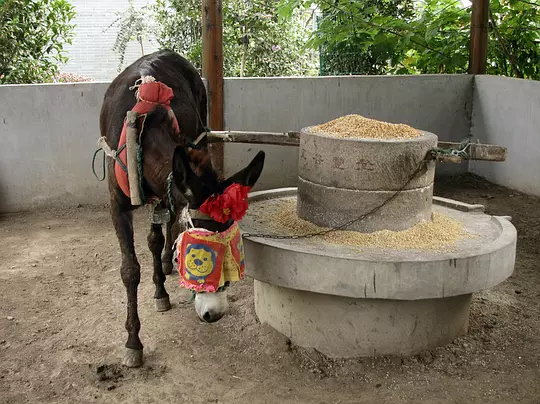
>
> 互联网便是以后的神经系统，将是我们永远不会摘下的VR眼镜。

{:start="2"}
2. 一种得救的路径。发展机器人技术，把人类从重复单调的劳动中解放出来，人类总体作为利维坦的高级神经系统。

> 诗2.1 昰要人永不为奴！

-------

The MIT License (MIT)

Copyright (c) 2016 lixvow

Permission is hereby granted, free of charge, to any person obtaining a copy of this software and associated documentation files (the "Software"), to deal in the Software without restriction, including without limitation the rights to use, copy, modify, merge, publish, distribute, sublicense, and/or sell copies of the Software, and to permit persons to whom the Software is

furnished to do so, subject to the following conditions:

The above copyright notice and this permission notice shall be included in all copies or substantial portions of the Software.

THE SOFTWARE IS PROVIDED "AS IS", WITHOUT WARRANTY OF ANY KIND, EXPRESS OR IMPLIED, INCLUDING BUT NOT LIMITED TO THE WARRANTIES OF MERCHANTABILITY, FITNESS FOR A PARTICULAR PURPOSE AND NONINFRINGEMENT. IN NO EVENT SHALL THE AUTHORS OR COPYRIGHT HOLDERS BE LIABLE FOR ANY CLAIM, DAMAGES OR OTHER LIABILITY, WHETHER IN AN ACTION OF CONTRACT, TORT OR OTHERWISE, ARISING FROM, OUT OF OR IN CONNECTION WITH THE SOFTWARE OR THE USE OR OTHER DEALINGS IN THE SOFTWARE.
